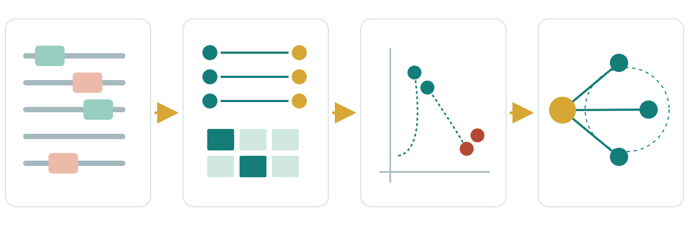

## From company to coordinates {.overview-slide}



<div class="overview-labels">
<div><b>1 · Observe</b><span>Tokens in a corpus</span></div>
<div><b>2 · Collect</b><span>Window pairs and counts</span></div>
<div><b>3 · Learn</b><span>Word2Vec and GloVe</span></div>
<div><b>4 · Inspect</b><span>Neighbors, uses, and limits</span></div>
</div>

::: {.takeaway}
Today's question: how can context generate the coordinates of meaning?
:::

## Before we begin {.question-slide}

::: {.big-question}
No dictionary. No labels. Only a billion words of text.

How could a machine discover that **coffee** and **tea** are related?
:::

::: {.fragment .answer}
Look at the company they keep.
:::

## The question Chapter 2 left open

::: {.analogy}
<span class="token t1">king</span>
<span class="operator">−</span>
<span class="token t3">man</span>
<span class="operator">+</span>
<span class="token t2">woman</span>
<span class="operator">≈</span>
<span class="token t4">queen</span>
:::

::: {.fragment .big-question}
Who chose the coordinates that make this possible?
:::

::: {.fragment .takeaway}
No one assigns them by hand. **Training organizes the space.**
:::

# What should distance mean? {.section-slide}

## Start with the simplest numbers

::: {.id-row}
<div><span class="token t1">apple</span><strong>→ 0</strong></div>
<div><span class="token t2">orange</span><strong>→ 1</strong></div>
<div><span class="token t3">car</span><strong>→ 2</strong></div>
<div><span class="token t4">bus</span><strong>→ 3</strong></div>
:::

::: {.fragment .wrong-math}
Is `orange` closer to `apple` than `bus` is?
:::

::: {.fragment .takeaway .danger}
Token IDs are addresses. Reorder the vocabulary and every “distance” changes.
:::

## One-hot solves the wrong problem

::: {.one-hot-grid .four-rows}
<div><strong>apple</strong><code>[1, 0, 0, 0]</code></div>
<div><strong>orange</strong><code>[0, 1, 0, 0]</code></div>
<div><strong>car</strong><code>[0, 0, 1, 0]</code></div>
<div><strong>bus</strong><code>[0, 0, 0, 1]</code></div>
:::

::: {.fragment .big-equation}
$d(\text{apple},\text{orange}) = d(\text{apple},\text{bus}) = \sqrt{2}$
:::

::: {.fragment .takeaway .danger}
Identity is preserved. Similarity is absent.
:::

## We need graded similarity

:::: {.embedding-layout}
::: {.embedding-vector}
**Dense vectors**

`apple  → [0.82, 0.16]`

`orange → [0.79, 0.22]`

`car    → [0.11, 0.85]`

`bus    → [0.16, 0.80]`
:::
::: {.mini-space}
<span class="mini-point fruit-a">apple</span>
<span class="mini-point fruit-b">orange</span>
<span class="mini-point vehicle-a">car</span>
<span class="mini-point vehicle-b">bus</span>
<span class="mini-axis x">dimension ? →</span>
<span class="mini-axis y">dimension ? →</span>
:::
::::

::: {.fragment .takeaway}
Useful structure lives in relationships among vectors—not in named coordinates.
:::

## Three ways to compare vectors

:::: {.three-col .metric-cards}
::: {.mini-card}
**Euclidean distance**

$$\lVert\mathbf{u}-\mathbf{v}\rVert_2$$

How far apart?
:::
::: {.mini-card}
**Dot product**

$$\mathbf{u}^{\mathsf T}\mathbf{v}$$

Alignment × length
:::
::: {.mini-card}
**Cosine similarity**

$$\frac{\mathbf{u}^{\mathsf T}\mathbf{v}}{\lVert\mathbf{u}\rVert\lVert\mathbf{v}\rVert}$$

Same direction?
:::
::::

::: {.fragment .takeaway}
Training uses dot products. We often query static embeddings with cosine similarity.
:::

## Similarity is not synonymy {.question-slide}

Which pair might be **closest** in a corpus-trained space?

:::: {.challenge-grid .wide}
::: {.challenge}
`hot` · `warm`
:::
::: {.challenge}
`hot` · `cold`
:::
::: {.challenge}
`hot` · `banana`
:::
::::

::: {.fragment .answer}
Both *warm* and *cold* can be close: synonyms and opposites share contexts.
:::

::: {.notes}
Ask for a vote. The important distinction is semantic similarity versus distributional relatedness. 2 minutes.
:::

# Meaning leaves traces in context {.section-slide}

## Two words you have never seen

:::: {.mystery-corpus}
::: {}
She poured the **dax** into a cup.  
The **dax** was hot and bitter.
:::
::: {.fragment}
She poured the **blicket** into a cup.  
The **blicket** was hot and sweet.
:::
::::

::: {.fragment .big-question}
What kind of things are *dax* and *blicket*?
:::

::: {.fragment .takeaway}
Shared surroundings provide evidence before a definition does.
:::

## The distributional hypothesis

::: {.definition}
Words that occur in similar **contexts** tend to have related meanings.
:::

::: {.company-quote}
“You shall know a word by the company it keeps.”

<span>— J. R. Firth, 1957</span>
:::

::: {.fragment .takeaway}
Turn patterns of usage into geometric relationships.
:::

<div class="citation">[@firth1957synopsis]</div>

## But what counts as context?

:::: {.two-col .context-choices}
::: {}
**Local context**

- nearby words;
- a fixed window;
- grammatical neighbors.
:::
::: {}
**Broader context**

- the sentence;
- the document;
- a domain or time period.
:::
::::

::: {.fragment .takeaway}
Context is a modeling decision. Different choices learn different notions of similarity.
:::

## Open a context window

::: {.window-sentence}
<span>the</span><span class="context-word">curious</span><span class="center-word">student</span><span class="context-word">reads</span><span>the</span><span>book</span>
:::

::: {.window-brace}
window radius = 1
:::

:::: {.fragment .pair-row}
<span>(student, curious)</span>
<span>(student, reads)</span>
::::

::: {.fragment .takeaway}
One sentence becomes many center–context training examples.
:::

## Change the window, change the evidence

::: {.window-sentence .wide-window}
<span class="context-word">the</span><span class="context-word">curious</span><span class="center-word">student</span><span class="context-word">reads</span><span class="context-word">the</span><span>book</span>
:::

::: {.window-brace .wide}
window radius = 2
:::

:::: {.fragment .pair-row}
<span>(student, the)</span>
<span>(student, curious)</span>
<span>(student, reads)</span>
<span>(student, the)</span>
::::

::: {.fragment .comparison-line}
Narrow windows → functional similarity &nbsp;&nbsp; | &nbsp;&nbsp; Wide windows → topical relatedness
:::

## You create the pairs {.question-slide}

::: {.sentence}
`students learn useful representations`
:::

With **window radius 1**, list every pair whose center is `learn`.

:::: {.fragment .pair-row .answer-pairs}
<span>(learn, students)</span>
<span>(learn, useful)</span>
::::

::: {.notes}
Give students 45 seconds alone, then compare with a neighbor. Emphasize ordered pairs: center and context have distinct roles.
:::

## The corpus labels itself

:::: {.pipeline-strip}
<div><strong>Text</strong><span>the student reads</span></div>
<b>→</b>
<div><strong>Window</strong><span>student ↔ reads</span></div>
<b>→</b>
<div><strong>Pair</strong><span>(student, reads)</span></div>
<b>→</b>
<div><strong>Label</strong><span>observed = 1</span></div>
::::

::: {.fragment .big-summary}
No human annotates “related.” The text supplies its own supervision.
:::

# Count the company words keep {.section-slide}

## A corpus small enough to hold

::: {.tiny-corpus}
<div><span>cats</span> <mark>chase</mark> <span>mice</span></div>
<div><span>dogs</span> <mark>chase</mark> <span>cats</span></div>
<div><span>dogs</span> <mark>eat</mark> <span>food</span></div>
<div><span>cats</span> <mark>eat</mark> <span>food</span></div>
:::

::: {.fragment .big-question}
Which two nouns appear in the most similar surroundings?
:::

::: {.fragment .answer}
`cats` and `dogs` both occur beside `chase` and `eat`.
:::

## Make the evidence explicit

| center ↓ / context → | `cats` | `dogs` | `chase` | `eat` | `mice` | `food` |
|---|---:|---:|---:|---:|---:|---:|
| **cats** | 0 | 0 | **2** | **1** | 0 | 0 |
| **dogs** | 0 | 0 | **1** | **1** | 0 | 0 |
| **chase** | 2 | 1 | 0 | 0 | 1 | 0 |
| **eat** | 1 | 1 | 0 | 0 | 0 | 2 |

::: {.fragment .takeaway}
A row is already a distributional representation of a word.
:::

## Read the rows as profiles

:::: {.profile-compare}
::: {}
**cats**

<span>chase · 2</span>
<span>eat · 1</span>
:::
::: {}
**dogs**

<span>chase · 1</span>
<span>eat · 1</span>
:::
::::

::: {.fragment .takeaway}
Similar rows → similar contextual behavior → potentially similar meaning.
:::

## Raw counts have three problems

:::: {.three-col .problem-cards}
::: {.card}
**Huge**

100,000 words

→ $10^{10}$ cells
:::
::: {.card}
**Sparse**

Most word pairs

never occur
:::
::: {.card}
**Dominated**

`the`, `of`, `and`

occur everywhere
:::
::::

::: {.fragment .takeaway .danger}
Frequent does not automatically mean informative.
:::

## Ask: “more often than chance?”

::: {.big-equation .pmi-equation}
$$\operatorname{PMI}(w,c)=\log\frac{P(w,c)}{P(w)P(c)}$$
:::

:::: {.three-col .compact-cards}
::: {.mini-card}
**Positive**

Surprisingly frequent together
:::
::: {.mini-card}
**Zero**

What independence predicts
:::
::: {.mini-card}
**Negative**

Avoid each other
:::
::::

::: {.fragment .takeaway}
Weighting separates informative association from raw popularity.
:::

## The classical route—then onward

:::: {.pipeline-strip .classical-route}
<div><strong>Count</strong><span>co-occurrences</span></div>
<b>→</b>
<div><strong>Weight</strong><span>PPMI</span></div>
<b>→</b>
<div><strong>Compress</strong><span>SVD</span></div>
<b>→</b>
<div><strong>Obtain</strong><span>dense vectors</span></div>
::::

::: {.fragment .takeaway}
Important history. Today, our main route learns the coordinates through prediction.
:::

## Checkpoint {.question-slide}

::: {.big-question}
What is the supervision signal for learning an embedding?
:::

:::: {.fragment .three-col .compact-cards}
::: {.mini-card}
**Not definitions**

No dictionary required
:::
::: {.mini-card}
**Not labels**

No annotation required
:::
::: {.mini-card}
**Observed context**

Windows create examples
:::
::::

::: {.notes}
Pause for one student to reconstruct the path from text to a row in the co-occurrence matrix. Optional short break. About 35 minutes elapsed.
:::

# Word2Vec {.section-slide}

## A tiny model with a powerful task

::: {.definition}
**Word2Vec** learns vectors by making local context predictions.
:::

:::: {.two-col .word2vec-variants}
::: {}
**Skip-gram**

<span class="token t1">student</span> → <span class="token t2">curious</span> <span class="token t3">reads</span>

Center predicts context
:::
::: {}
**CBOW**

<span class="token t2">curious</span> <span class="token t3">reads</span> → <span class="token t1">student</span>

Context predicts center
:::
::::

::: {.fragment .takeaway}
We focus on **Skip-gram with negative sampling**.
:::

<div class="citation">[@mikolov2013efficient; @mikolov2013distributed]</div>

## Skip-gram: one center, several targets

::: {.skipgram-star}
<div class="sg-center">student</div>
<div class="sg-context sg1">the</div>
<div class="sg-context sg2">curious</div>
<div class="sg-context sg3">reads</div>
<div class="sg-context sg4">the</div>
:::

::: {.fragment .pair-row}
<span>(student, the)</span>
<span>(student, curious)</span>
<span>(student, reads)</span>
<span>(student, the)</span>
:::

## Step 1 · Look up the center vector

:::: {.lookup-layout}
::: {.lookup-table}
<div>apple <span>[ … ]</span></div>
<div class="selected">student <span>[ 0.4, −0.2, … ]</span></div>
<div>reads <span>[ … ]</span></div>
<div>book <span>[ … ]</span></div>
:::
::: {.lookup-arrow}
→
:::
::: {.embedding-vector}
**center vector** $\mathbf{v}_{student}$

`[0.4, −0.2, …]`
:::
::::

::: {.fragment .takeaway}
An embedding layer is a trainable table lookup.
:::

## Step 2 · Look up the context vector

:::: {.lookup-layout}
::: {.lookup-table .context-table}
<div>curious <span>[ … ]</span></div>
<div class="selected">reads <span>[ 0.7, 0.1, … ]</span></div>
<div>the <span>[ … ]</span></div>
<div>book <span>[ … ]</span></div>
:::
::: {.lookup-arrow}
→
:::
::: {.embedding-vector}
**context vector** $\mathbf{u}_{reads}$

`[0.7, 0.1, …]`
:::
::::

::: {.fragment .takeaway}
Skip-gram trains **two** tables: center vectors and context vectors.
:::

## Step 3 · Score compatibility

::: {.score-visual}
<div class="score-vector">$\mathbf{v}_{student}$</div>
<div class="operator">·</div>
<div class="score-vector context">$\mathbf{u}_{reads}$</div>
<div class="operator">=</div>
<div class="score-result">$s$</div>
<div class="operator">→</div>
<div class="score-result sigmoid">$\sigma(s)$</div>
:::

::: {.fragment .big-equation}
$s(student,reads)=\mathbf{u}_{reads}^{\mathsf T}\mathbf{v}_{student}$
:::

::: {.fragment .takeaway}
Observed pair? Make the score large.
:::

## The full prediction is expensive

::: {.big-equation .softmax-equation}
$$P(c\mid w)=\frac{\exp(\mathbf{u}_c^{\mathsf T}\mathbf{v}_w)}
{\sum_{c'\in V}\exp(\mathbf{u}_{c'}^{\mathsf T}\mathbf{v}_w)}$$
:::

::: {.fragment .vocab-wall}
`the` · `of` · `language` · `cat` · `democracy` · … · **every word in $V$**
:::

::: {.fragment .takeaway .danger}
Every training pair would score the entire vocabulary.
:::

## Can we ask an easier question? {.question-slide}

::: {.big-question}
Instead of “Which word among 100,000?” ask:

**“Is this pair real or fake?”**
:::

::: {.fragment .answer}
That is the idea behind negative sampling.
:::

# Negative sampling {.section-slide}

## One positive, a few negatives

::: {.negative-list}
<div class="positive"><span>(student, reads)</span><strong>observed · 1</strong></div>
<div class="negative fragment"><span>(student, pineapple)</span><strong>sampled · 0</strong></div>
<div class="negative fragment"><span>(student, ocean)</span><strong>sampled · 0</strong></div>
<div class="negative fragment"><span>(student, bicycle)</span><strong>sampled · 0</strong></div>
:::

::: {.fragment .takeaway}
Learn a small binary decision instead of a huge multiclass decision.
:::

## What the loss asks for

::: {.objective-split}
<div class="pull">
<strong>Observed pair</strong>

$\log\sigma(\mathbf{u}_c^T\mathbf{v}_w)$

raise the score ↑
</div>
<div class="push fragment">
<strong>Noise pairs</strong>

$\sum_i\log\sigma(-\mathbf{u}_{n_i}^T\mathbf{v}_w)$

lower the scores ↓
</div>
:::

::: {.fragment .takeaway}
Pull compatible directions together; push sampled noise apart.
:::

## Word2Vec training pairs {#word2vec-data .lab-slide .visual-only}

<table id="w2v-counts" aria-label="Observed context counts for eight target words"><thead><tr><th>Target</th><th>Context 1</th><th>Context 2</th></tr></thead><tbody><tr><td colspan="3">Generating data…</td></tr></tbody></table>

## Watch actual Word2Vec training {#word2vec-training .lab-slide .visual-only}

<div id="w2v-demo">
<div class="sim-toolbar">
<button id="w2v-play" type="button">Play training</button>
<button id="w2v-step" type="button">+1 epoch</button>
<button id="w2v-reset" type="button">Reset</button>
<button id="w2v-final" type="button">Final result</button>
<div class="sim-scrubber"><label for="w2v-slider" id="w2v-epoch">Epoch 0 / 30</label><input id="w2v-slider" type="range" min="0" max="30" value="0" aria-label="Training epoch"></div>
</div>
<div class="simulation-only">
<div id="w2v-scatter"></div>
<div class="simulation-loss"><span>Loss <b id="w2v-loss"></b></span><div id="w2v-loss-plot"></div></div>
</div>
</div>

::: {.notes}
The browser trains eight-dimensional embeddings for 30 epochs. The eight target words are shown in a fixed PCA projection fitted to the final vectors. Colors identify corpus groups; group labels are not used for training. The curve measures mean binary loss on a fixed diagnostic sample. Play, pause, step, reset, or scrub to inspect the computed checkpoints.
:::

## The whole learning loop

:::: {.learning-loop}
<div><b>1</b><span>choose a center</span></div>
<div><b>2</b><span>collect true contexts</span></div>
<div><b>3</b><span>sample noise words</span></div>
<div><b>4</b><span>score the pairs</span></div>
<div><b>5</b><span>compute binary loss</span></div>
<div><b>6</b><span>update both tables</span></div>
::::

::: {.fragment .big-summary}
Repeat across the corpus. Geometry is the accumulated history of updates.
:::

## Word2Vec in 14 lines

```{.python code-line-numbers="1-2|4-9|11-14"}
from torch import nn

class SkipGram(nn.Module):
    def __init__(self, vocab_size, dim):
        super().__init__()
        self.center = nn.Embedding(vocab_size, dim)
        self.context = nn.Embedding(vocab_size, dim)

    def forward(self, center_ids, context_ids):
        v = self.center(center_ids)
        u = self.context(context_ids)
        return (v * u).sum(dim=-1)
```

::: {.fragment .takeaway}
The architecture is tiny. The corpus and training objective do the work.
:::

## Train the binary decision

```{.python code-line-numbers="1-3|5|6"}
scores = model(center_ids, context_ids)
loss = nn.functional.binary_cross_entropy_with_logits(
    scores, labels
)
loss.backward()
optimizer.step()
```

::: {.fragment .code-output}
`labels = [1, 0, 0, 0]` &nbsp; for one observed and three sampled pairs
:::

::: {.fragment .takeaway}
Backpropagation changes the rows used in those pair decisions.
:::

## Why sample frequent words differently?

::: {.frequency-scale}
<div class="very-common">the</div>
<div class="common">student</div>
<div class="medium">pineapple</div>
<div class="rare">photosynthesis</div>
:::

::: {.fragment .big-equation}
$P_{noise}(w) \propto \operatorname{count}(w)^{3/4}$
:::

::: {.fragment .takeaway}
The smoothed distribution reduces domination by the most frequent words without ignoring them.
:::

## CBOW: reverse the arrow

::: {.cbow-visual}
<div class="cbow-context"><span>the</span><span>curious</span><span>reads</span><span>the</span></div>
<div class="lookup-arrow">→</div>
<div class="cbow-merge">average</div>
<div class="lookup-arrow">→</div>
<div class="cbow-center">student</div>
:::

:::: {.fragment .two-col .comparison-cards}
::: {}
**CBOW** · faster, smooths contexts
:::
::: {}
**Skip-gram** · often stronger for rare words
:::
::::

::: {.takeaway}
Same distributional principle; opposite prediction direction.
:::

## Explain it without equations {.question-slide}

::: {.big-question}
Why do two words acquire similar vectors if they appear in similar contexts?
:::

::: {.fragment .answer}
They repeatedly solve similar prediction problems, so training gives them similar updates.
:::

::: {.notes}
This is the central checkpoint. Ask one student to explain, then ask another to improve or challenge the explanation. About 60 minutes elapsed.
:::

# GloVe {.section-slide}

## Local prediction vs global counts {.glove-simple}

| Toy sentence | Copies | Toy sentence | Copies |
|---|---:|---|---:|
| `ice solid` | 8 | `steam solid` | 2 |
| `ice gas` | 2 | `steam gas` | 8 |
| `ice water` | 10 | `steam water` | 10 |

::: {.count-prompt}
**PAUSE · build three cells**

Window ±1; count both directions; never cross sentences.

Find $X_{ice,solid}$, $X_{solid,ice}$, and $X_{ice,steam}$.
:::

::: {.notes}
These are invented teaching data. Word2Vec processes the individual pairs; GloVe aggregates them into counts across the corpus. There are forty two-token sentences. Each neighboring token contributes one. The next slide contains the complete matrix, with no worked-answer side panel.
:::

## Global co-occurrence counts {.glove-simple .matrix-only}

| center ↓ / context → | ice | steam | solid | gas | water |
|---|---:|---:|---:|---:|---:|
| **ice** | 0 | 0 | **8** | 2 | 10 |
| **steam** | 0 | 0 | 2 | **8** | 10 |
| **solid** | **8** | 2 | 0 | 0 | 0 |
| **gas** | 2 | **8** | 0 | 0 | 0 |
| **water** | 10 | 10 | 0 | 0 | 0 |

::: {.notes}
The answers are visible in the matrix: 8, 8, 0. Ice and steam each have row total twenty. Use these totals on the next slide to compare conditional context probabilities. “Global” means aggregation over all local windows, not an unlimited context window.
:::

## Ratios reveal relationships {.glove-simple}

| probe | $P(c\mid ice)$ | $P(c\mid steam)$ | ratio |
|---|---:|---:|---:|
| **solid** | 8 / 20 | 2 / 20 | **4** |
| **gas** | 2 / 20 | 8 / 20 | **¼** |
| **water** | 10 / 20 | 10 / 20 | **1** |

::: {.fragment .takeaway}
**solid** favors ice · **gas** favors steam · **water** is shared.
:::



## The GloVe objective—read it in pieces {.glove-simple}

::: {.glove-equation}
$$J=\sum_{X_{ij}>0}f(X_{ij})
\left(\mathbf{w}_i^T\widetilde{\mathbf{w}}_j+b_i+\widetilde b_j-\log X_{ij}\right)^2$$
:::

:::: {.fragment .equation-legend}
<span><b>$X_{ij}$</b> global count</span>
<span><b>dot product + biases</b> predicted log count</span>
<span><b>$\log X_{ij}$</b> target</span>
<span><b>$f$</b> weight evidence</span>
::::

## What is GloVe trying to do? {.glove-simple}

:::: {.pipeline-strip .glove-route}
<div><strong>Observe</strong><span>$X_{ice,solid}=8$<br>$\log 8 \approx 2.08$</span></div>
<b>→</b>
<div><strong>Predict</strong><span>dot product<br>+ two biases</span></div>
<b>→</b>
<div><strong>Compare</strong><span>weighted<br>squared error</span></div>
<b>→</b>
<div><strong>Update</strong><span>vectors + biases</span></div>
::::

::: {.fragment .takeaway}
Make vector compatibility reconstruct global co-occurrence structure.
:::

## Word2Vec and GloVe {.glove-simple}

| | **Word2Vec Skip-gram** | **GloVe** |
|---|---|---|
| Signal | local pairs | global counts |
| Task | real vs sampled pair | fit log co-occurrence |
| Corpus statistics | indirect | explicit |
| Output | static vectors | static vectors |

::: {.fragment .takeaway}
Predict contexts—or reconstruct their counts.
:::

## A false contrast to avoid {.glove-simple}

::: {.wrong-contrast}
<span>Word2Vec = neural</span>
<strong>vs</strong>
<span>GloVe = just counting</span>
:::

::: {.fragment .answer}
Both optimize learned parameters. Both encode transformed co-occurrence evidence.
:::

::: {.fragment .takeaway}
Compare their **objectives**, not marketing labels.
:::

# Use real embeddings {.section-slide}

## Three influential families

| Family | Training idea | Famous release | Special strength |
|---|---|---|---|
| **Word2Vec** | predict contexts | Google News · 300d | historical influence |
| **GloVe** | fit global counts | Wiki + Gigaword · 50–300d | convenient sizes |
| **fastText** | add character $n$-grams | Common Crawl · 300d | morphology + unseen forms |

::: {.fragment .takeaway}
spaCy exposes vectors in a practical pipeline; it is not itself an embedding algorithm.
:::

## Ask GloVe with Gensim

```{.python code-line-numbers="1-3|5-6|8-12"}
import gensim.downloader as api

wv = api.load("glove-wiki-gigaword-100")

wv.similarity("coffee", "tea")
wv.most_similar("language", topn=5)

wv.most_similar(
    positive=["king", "woman"],
    negative=["man"], topn=3
)
```

::: {.fragment .code-output}
`king − man + woman → queen, monarch, throne`
:::

## Use vectors through spaCy

```{.python code-line-numbers="1-3|5-7|9-10"}
import spacy
nlp = spacy.load("en_core_web_md")

coffee = nlp.vocab["coffee"]
tea = nlp.vocab["tea"]
airplane = nlp.vocab["airplane"]

coffee.similarity(tea)
coffee.similarity(airplane)
```

::: {.fragment .warning}
`en_core_web_sm` has no full static-vector table. Use `md` or `lg`.
:::

## fastText looks inside the word

::: {.subword-build}
<div class="whole-word">teaching</div>
<div class="down">↓</div>
<div class="ngram-row"><span>&lt;te</span><span>tea</span><span>eac</span><span>ach</span><span>chi</span><span>hin</span><span>ing</span><span>ng&gt;</span></div>
<div class="down">↓</div>
<div class="whole-word vector-result">sum the subword vectors</div>
:::

::: {.fragment .takeaway}
Shared character pieces help with morphology, rare words, and unseen forms.
:::

<div class="citation">[@bojanowski2017fasttext]</div>

## A 100-D space shown in 2-D

::: {.semantic-map .large-map .embedding-demo-map}
<span class="cluster-label royalty-label">royalty</span>
<span class="point royal king">king</span>
<span class="point royal queen">queen</span>
<span class="point royal prince">prince</span>
<span class="point drink coffee-map">coffee</span>
<span class="point drink tea-map">tea</span>
<span class="point vehicle car-map">car</span>
<span class="point vehicle bus-map">bus</span>
<span class="cluster-label drinks-label">drinks</span>
<span class="cluster-label vehicles-label">vehicles</span>
:::

::: {.takeaway}
PCA gives us a useful picture—not the original geometry.
:::

## Nearest neighbors are evidence {.question-slide}

When inspecting a query, ask:

:::: {.two-col .inspection-list}
::: {}
- synonyms or topical associates?
- grammatical alternatives?
- rare word or common word?
:::
::: {}
- appropriate domain?
- appropriate language?
- stereotype or useful pattern?
:::
::::

::: {.fragment .answer}
A similarity score is the beginning of analysis—not the conclusion.
:::

# What static vectors miss {.section-slide}

## One spelling, two meanings

:::: {.bank-example}
::: {}
She deposited money at the **bank**.

🏦
:::
::: {}
They sat on the river **bank**.

🏞️
:::
::::

::: {.fragment .same-vector}
Both → one stored vector for `bank`
:::

::: {.fragment .takeaway .danger}
Static embeddings blend word senses into one context-independent point.
:::

## The corpus becomes the boundary

:::: {.three-col .problem-cards}
::: {.card}
**Missing**

new names and events
:::
::: {.card}
**Uneven**

languages and dialects
:::
::: {.card}
**Biased**

historical associations
:::
::::

::: {.fragment .takeaway .danger}
The vectors describe patterns in training text—not objective human meaning.
:::

## Bias is geometric too

::: {.analogy .biased-analogy}
<span class="token t1">man</span>
<span class="operator">:</span>
<span class="token t3">programmer</span>
<span class="operator">::</span>
<span class="token t2">woman</span>
<span class="operator">:</span>
<span class="token t4">?</span>
:::

::: {.fragment .warning}
The same regularities that make analogies impressive can reproduce stereotypes.
:::

::: {.fragment .takeaway}
Evaluate who and what the embedding represents poorly—not only its average score.
:::

<div class="citation">[@bolukbasi2016debiasing]</div>

## Intrinsic ≠ useful downstream

:::: {.two-col .evaluation-cards}
::: {}
**Intrinsic evaluation**

similarity · analogy · neighborhoods
:::
::: {}
**Extrinsic evaluation**

classification · search · task performance
:::
::::

::: {.fragment .big-summary}
Beautiful neighbors do not guarantee a better application.
:::

## The complete story

:::: {.journey .final-journey}
::: {.stage}
**CORPUS**

Observed language
:::
::: {.arrow}
→
:::
::: {.stage}
**CONTEXT**

Distributional signal
:::
::: {.arrow}
→
:::
::: {.stage}
**OBJECTIVE**

Word2Vec or GloVe
:::
::: {.arrow}
→
:::
::: {.stage .active}
**GEOMETRY**

Learned relationships
:::
::::

::: {.fragment .big-summary}
Words do not arrive with meaning coordinates. Their usage patterns shape the space.
:::

## Five ideas to keep

::: {.five-ideas}
<div><b>1</b><span>IDs identify; embeddings relate.</span></div>
<div class="fragment"><b>2</b><span>Context supplies supervision.</span></div>
<div class="fragment"><b>3</b><span>Word2Vec predicts local company.</span></div>
<div class="fragment"><b>4</b><span>GloVe fits global co-occurrence.</span></div>
<div class="fragment"><b>5</b><span>Every geometry inherits corpus limits.</span></div>
:::

## Exit ticket {.question-slide}

Answer in one sentence each:

1. Why can token IDs not encode semantic distance?
2. How does a context window create supervision?
3. What problem does negative sampling solve?
4. What is the essential difference between Word2Vec and GloVe?
5. Why does one vector for `bank` create a limitation?

::: {.fragment .next}
**Next:** statistical NLP—turning representations into predictions and evaluating what they learn.
:::

## Further reading

- Mikolov et al., “Efficient Estimation of Word Representations in Vector Space” [@mikolov2013efficient].
- Mikolov et al., “Distributed Representations of Words and Phrases” [@mikolov2013distributed].
- Pennington, Socher & Manning, “GloVe” [@pennington2014glove].
- Bojanowski et al., “Enriching Word Vectors with Subword Information” [@bojanowski2017fasttext].
- Stanford CS224N Lecture 1 notes [@hewitt2023cs224n].
- Tools: [Gensim KeyedVectors](https://radimrehurek.com/gensim/models/keyedvectors.html), [GloVe](https://nlp.stanford.edu/projects/glove/), [fastText](https://fasttext.cc/docs/en/crawl-vectors.html), and [spaCy models](https://spacy.io/models).

::: {.big-summary}
**One sentence to keep:** meaning becomes learnable when context becomes a prediction problem.
:::

## References {.smaller}

::: {#refs}
:::

## A vector is a representation. What makes a prediction? {.bridge-slide}

<div class="prediction-bridge" role="img" aria-label="A review becomes word vectors, which flow into an unknown decision mechanism. Two possible class outputs lead to a held-out evaluation question.">
<div class="bridge-review"><b>A new review</b><span>“the movie was moving”</span></div>
<div class="bridge-transfer"><i></i><i></i><i></i></div>
<div class="bridge-vectors"><span>the ▰ ▱ ▰</span><span>movie ▱ ▰ ▰</span><span>was ▰ ▰ ▱</span><span>moving ▱ ▰ ▱</span></div>
<div class="bridge-transfer"><i></i><i></i><i></i></div>
<div class="bridge-unknown"><strong>?</strong><span>learn a decision</span></div>
<div class="bridge-transfer"><i></i><i></i><i></i></div>
<div class="bridge-outcomes"><span>positive?</span><span>negative?</span><b>Test on unseen reviews</b></div>
</div>

::: {.big-summary}
What extra evidence would let us turn these vectors into a prediction we can trust?
:::
