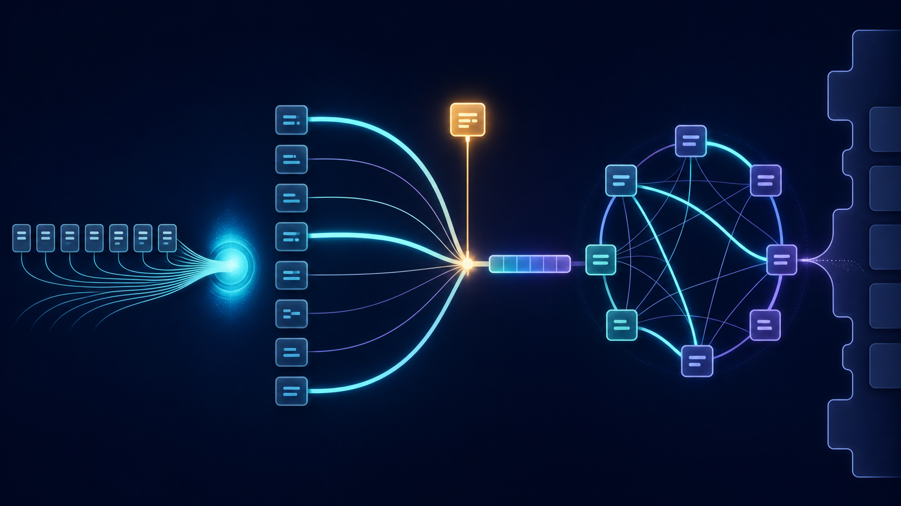

## From one compressed memory to direct access {.overview-slide}

{.overview-image fig-alt="A sequence compressed into one bottleneck gives way to weighted query-to-token connections, followed by direct self-attention connections and an unfinished bridge toward the Transformer architecture"}

::::::: {.overview-labels}
::: {.overview-label}
**BOTTLENECK**

One vector must carry everything
:::
::: {.overview-label}
**SOFT LOOKUP**

Learn how much to retrieve
:::
::: {.overview-label}
**CROSS-ATTENTION**

Connect decoder to source
:::
::: {.overview-label}
**Q · K · V**

Ask, match, and retrieve
:::
::: {.overview-label}
**SELF-ATTENTION**

Let tokens connect directly
:::
::: {.overview-label}
**NEXT**

Build a complete architecture
:::
:::::::

<div class="citation">Lecture journey follows [Stanford CS224N Lecture 5](https://web.stanford.edu/class/cs224n/slides_w26/cs224n-2026-lecture05-transformers.pdf) and the visual intuition of [The Illustrated Transformer](https://jalammar.github.io/illustrated-transformer/).</div>

## What we will cover

::: {.toc-route}
<div><b>1</b><strong>THE ENCODER BOTTLENECK</strong><span>Why one fixed vector is not enough</span></div>
<div><b>2</b><strong>ATTENTION AS SOFT LOOKUP</strong><span>Score, normalize, and retrieve</span></div>
<div><b>3</b><strong>CROSS-ATTENTION</strong><span>Queries, keys, and values in translation</span></div>
<div><b>4</b><strong>SELF-ATTENTION</strong><span>Direct connections inside one sequence</span></div>
<div><b>5</b><strong>MODERN ATTENTION</strong><span>Scaling, causal masking, and multiple heads</span></div>
<div><b>6</b><strong>THE TRANSFORMER BRIDGE</strong><span>What attention still needs to become a model</span></div>
:::

<div class="citation">Progression adapted from the attention-first treatment in [Stanford CS224N](https://web.stanford.edu/class/cs224n/slides_w26/cs224n-2026-lecture05-transformers.pdf); visual explanations informed by [Alammar’s tutorial](https://jalammar.github.io/illustrated-transformer/).</div>

# Part I · The encoder bottleneck {.section-slide}

## Recall: one RNN reads, another writes

::: {.seq2seq-lead}
The encoder's <b>final hidden state</b> becomes the decoder's <b>initial hidden state</b>.
:::

::: {.seq2seq-stage}
<svg viewBox="0 0 1320 560" role="img" aria-label="An encoder RNN reads a French sentence. Its final state becomes one context vector that initializes a decoder RNN producing the English translation.">
  <defs><marker id="seq2seq-arrow" viewBox="0 0 10 10" refX="9" refY="5" markerUnits="userSpaceOnUse" markerWidth="8" markerHeight="8" orient="auto"><path d="M0 0 L10 5 L0 10 z"></path></marker></defs>
  <g class="fragment seq2seq-encoder" data-fragment-index="0">
    <rect class="phase-field encoder-field" x="20" y="30" width="615" height="455" rx="25"></rect><text class="phase-kicker" x="50" y="75">1 · ENCODE THE SOURCE</text><text class="phase-description" x="50" y="108">Read every French token into a running state.</text><path class="state-chain encoder-chain" d="M105 245 H570"></path>
    <g class="rnn-state"><rect x="65" y="195" width="100" height="100" rx="18"></rect><text x="115" y="255">h₁</text></g><g class="rnn-state"><rect x="220" y="195" width="100" height="100" rx="18"></rect><text x="270" y="255">h₂</text></g><g class="rnn-state"><rect x="375" y="195" width="100" height="100" rx="18"></rect><text x="425" y="255">h₃</text></g><g class="rnn-state final-encoder-state"><rect x="530" y="195" width="100" height="100" rx="18"></rect><text x="580" y="255">h₄</text></g>
    <g class="token-input"><path d="M115 375 V305"></path><text x="115" y="415">Le</text></g><g class="token-input"><path d="M270 375 V305"></path><text x="270" y="415">colis</text></g><g class="token-input"><path d="M425 375 V305"></path><text x="425" y="415">arrivera</text></g><g class="token-input"><path d="M580 375 V305"></path><text x="580" y="415">demain</text></g><text class="sequence-label" x="335" y="462">SOURCE SEQUENCE · x₁ … x₄</text>
  </g>
  <g class="fragment seq2seq-bridge" data-fragment-index="1"><path class="context-bridge" d="M630 245 H735"></path><circle cx="682" cy="245" r="38"></circle><text class="context-symbol" x="682" y="253">c</text><text class="context-label" x="682" y="160">CONTEXT</text><text class="context-note" x="682" y="330">c = h₄</text><text class="context-note small" x="682" y="357">all source information</text></g>
  <g class="fragment seq2seq-decoder" data-fragment-index="2">
    <rect class="phase-field decoder-field" x="735" y="30" width="565" height="455" rx="25"></rect><text class="phase-kicker" x="765" y="75">2 · DECODE THE TARGET</text><text class="phase-description" x="765" y="108">Start from c, then generate one English token at a time.</text><path class="state-chain decoder-chain" d="M735 245 H1245"></path>
    <g class="rnn-state decoder-state"><rect x="750" y="195" width="100" height="100" rx="18"></rect><text x="800" y="255">s₁</text></g><g class="rnn-state decoder-state"><rect x="895" y="195" width="100" height="100" rx="18"></rect><text x="945" y="255">s₂</text></g><g class="rnn-state decoder-state"><rect x="1040" y="195" width="100" height="100" rx="18"></rect><text x="1090" y="255">s₃</text></g><g class="rnn-state decoder-state"><rect x="1185" y="195" width="100" height="100" rx="18"></rect><text x="1235" y="255">s₄</text></g>
    <g class="token-output"><path d="M800 295 V355"></path><text x="800" y="390">The</text></g><g class="token-output"><path d="M945 295 V355"></path><text x="945" y="390">package</text></g><g class="token-output"><path d="M1090 295 V355"></path><text x="1090" y="390">will arrive</text></g><g class="token-output"><path d="M1235 295 V355"></path><text x="1235" y="390">tomorrow</text></g><text class="sequence-label" x="1015" y="462">TARGET SEQUENCE · y₁ … y₄</text>
  </g>
</svg>
:::

::: {.seq2seq-takeaway .fragment data-fragment-index="3"}
The whole source sentence reaches the decoder through <b>one fixed-size vector, c</b>.
:::

<div class="citation">This is the recurrent encoder–decoder architecture developed in the previous lecture [@sutskever2014sequence; @cho2014gru].</div>

## One vector must remember everything

::: {.nmt-bottleneck-stage}
<svg viewBox="0 0 1320 425" role="img" aria-label="Every source state is compressed through one fixed-size context vector before the decoder generates every target token.">
  <defs><marker id="bottleneck-arrow" viewBox="0 0 10 10" refX="9" refY="5" markerUnits="userSpaceOnUse" markerWidth="8" markerHeight="8" orient="auto"><path d="M0 0 L10 5 L0 10 z"></path></marker></defs>
  <rect class="bottleneck-zone bottleneck-encoder-zone" x="25" y="45" width="560" height="330" rx="24"></rect><text class="bottleneck-zone-title" x="55" y="85">ENCODER · READ THE WHOLE SOURCE</text><rect class="bottleneck-zone bottleneck-decoder-zone" x="735" y="45" width="560" height="330" rx="24"></rect><text class="bottleneck-zone-title" x="765" y="85">DECODER · GENERATE THE WHOLE TARGET</text><path class="bottleneck-forward" d="M95 220 H1225"></path>
  <g class="bottleneck-state encoder-bottleneck-state"><rect x="55" y="175" width="90" height="90" rx="16"></rect><text x="100" y="230">h₁</text></g><g class="bottleneck-state encoder-bottleneck-state"><rect x="190" y="175" width="90" height="90" rx="16"></rect><text x="235" y="230">h₂</text></g><g class="bottleneck-state encoder-bottleneck-state"><rect x="325" y="175" width="90" height="90" rx="16"></rect><text x="370" y="230">h₃</text></g><g class="bottleneck-state encoder-bottleneck-state"><rect x="460" y="175" width="90" height="90" rx="16"></rect><text x="505" y="230">h₄</text></g><g class="bottleneck-context"><circle cx="660" cy="220" r="47"></circle><text x="660" y="230">c</text><text class="bottleneck-context-label" x="660" y="133">ONE FIXED-SIZE VECTOR</text></g>
  <g class="bottleneck-state decoder-bottleneck-state"><rect x="755" y="175" width="90" height="90" rx="16"></rect><text x="800" y="230">s₁</text></g><g class="bottleneck-state decoder-bottleneck-state"><rect x="890" y="175" width="90" height="90" rx="16"></rect><text x="935" y="230">s₂</text></g><g class="bottleneck-state decoder-bottleneck-state"><rect x="1025" y="175" width="90" height="90" rx="16"></rect><text x="1070" y="230">s₃</text></g><g class="bottleneck-state decoder-bottleneck-state"><rect x="1160" y="175" width="90" height="90" rx="16"></rect><text x="1205" y="230">s₄</text></g>
  <g class="bottleneck-source"><text x="100" y="315">Le</text><text x="235" y="315">colis</text><text x="370" y="315">arrivera</text><text x="505" y="315">demain</text></g><g class="bottleneck-target"><text x="800" y="315">The</text><text x="935" y="315">package</text><text x="1070" y="315">will arrive</text><text x="1205" y="315">tomorrow</text></g>
  <g class="fragment bottleneck-pressure" data-fragment-index="0"><path d="M100 340 C250 405 500 405 620 255"></path><path d="M235 340 C350 390 520 380 625 250"></path><path d="M370 340 C455 365 550 350 630 245"></path><path d="M505 340 C560 340 605 300 635 245"></path><text x="355" y="405">every source detail must survive inside c</text></g>
</svg>
:::

::: {.bottleneck-question .fragment data-fragment-index="1"}
<small>PAUSE · FIND THE LIMITATION</small>
<b>When the decoder needs “demain,” what source representation can it inspect directly?</b>
:::

<div class="citation">Early recurrent seq2seq models summarize a variable-length source with a fixed-dimensional context [@cho2014gru].</div>

## The bottleneck is not only storage—it is access

:::: {.access-problem-layout}
::: {.access-only-path}
<small>THE ONLY AVAILABLE PATH</small>

<svg class="access-path-svg" viewBox="0 0 620 300" role="img" aria-label="Four source tokens converge through the single context vector c, which alone supplies decoder state s4 to generate tomorrow.">
  <defs><marker id="access-arrow" viewBox="0 0 10 10" refX="9" refY="5" markerUnits="userSpaceOnUse" markerWidth="5" markerHeight="5" orient="auto"><path d="M0 0 L10 5 L0 10 z"></path></marker></defs>
  <g class="access-source-box"><rect x="15" y="18" width="125" height="58" rx="9"></rect><text x="77" y="55">Le</text></g>
  <g class="access-source-box"><rect x="170" y="18" width="125" height="58" rx="9"></rect><text x="232" y="55">colis</text></g>
  <g class="access-source-box"><rect x="325" y="18" width="125" height="58" rx="9"></rect><text x="387" y="55">arrivera</text></g>
  <g class="access-source-box needed"><rect x="480" y="18" width="125" height="58" rx="9"></rect><text x="542" y="55">demain</text></g>
  <g class="access-funnel"><path d="M77 76 C77 125 245 120 286 155"></path><path d="M232 76 C232 115 275 120 300 151"></path><path d="M387 76 C387 115 345 120 320 151"></path><path d="M542 76 C542 125 375 120 334 155"></path></g>
  <g class="access-context"><circle cx="310" cy="177" r="40"></circle><text x="310" y="187">c</text></g>
  <path class="access-single-route" d="M310 217 V242 H177"></path>
  <g class="access-decoder-state"><rect x="112" y="228" width="74" height="64" rx="11"></rect><text x="149" y="268">s₄</text></g>
  <text class="access-output" x="330" y="270">→ “tomorrow”</text>
</svg>

$$p(y_t\mid y_{<t},\,\mathbf{c})$$
:::

::: {.access-consequences}
<div class="fragment"><b>1 · COMPRESS</b><span>Every source detail competes for space inside the same vector.</span></div>
<div class="fragment"><b>2 · CARRY</b><span>Early information must survive every later encoder update.</span></div>
<div class="fragment"><b>3 · RECOVER</b><span>Every decoder step must reconstruct what it needs from c alone.</span></div>
:::
::::

::: {.access-synthesis .fragment}
The decoder does not lack the source sentence—it lacks a <b>direct way to retrieve the relevant part.</b>
:::

::: {.next-question .fragment}
What if each decoder step could look back at <b>all encoder states</b> and choose where to focus?
:::

<div class="citation">Attention was introduced to replace the single fixed-context dependency with learned access to encoder states [@bahdanau2015align].</div>

# Part II · Attention as soft lookup {.section-slide}

## Keep every source memory

::: {.memory-shift-lead}
Instead of asking the decoder to recover everything from $c=h_4$, preserve <b>all encoder states</b>.
:::

::: {.memory-shift-stage}
<svg viewBox="0 0 1320 520" role="img" aria-label="The fixed-context architecture is replaced by direct paths from all four encoder states to the active decoder state.">
  <defs><marker id="memory-shift-arrow" viewBox="0 0 10 10" refX="9" refY="5" markerUnits="userSpaceOnUse" markerWidth="6" markerHeight="6" orient="auto"><path d="M0 0 L10 5 L0 10 z"></path></marker></defs>
  <g class="fixed-memory-side">
    <text class="memory-side-title" x="290" y="44">BEFORE · ONE SUMMARY</text>
    <g class="memory-state"><rect x="45" y="110" width="90" height="78" rx="13"></rect><text x="90" y="158">h₁</text></g><g class="memory-state"><rect x="175" y="110" width="90" height="78" rx="13"></rect><text x="220" y="158">h₂</text></g><g class="memory-state"><rect x="305" y="110" width="90" height="78" rx="13"></rect><text x="350" y="158">h₃</text></g><g class="memory-state"><rect x="435" y="110" width="90" height="78" rx="13"></rect><text x="480" y="158">h₄</text></g>
    <g class="memory-tokens"><text x="90" y="225">Le</text><text x="220" y="225">colis</text><text x="350" y="225">arrivera</text><text x="480" y="225">demain</text></g>
    <path class="fixed-summary-path" d="M90 188 C120 310 250 330 292 350 M220 188 C230 285 275 315 300 346 M350 188 C345 285 325 315 315 346 M480 188 C450 310 360 330 325 350"></path>
    <g class="old-context"><circle cx="308" cy="382" r="39"></circle><text x="308" y="392">c</text></g><path class="fixed-summary-path" d="M347 382 H500"></path>
    <g class="active-decoder"><rect x="500" y="340" width="90" height="84" rx="14"></rect><text x="545" y="391">s₄</text></g>
  </g>
  <g class="fragment direct-memory-side" data-fragment-index="0">
    <text class="memory-side-title" x="1000" y="44">NOW · A SET OF MEMORIES</text>
    <g class="memory-state"><rect x="725" y="110" width="90" height="78" rx="13"></rect><text x="770" y="158">h₁</text></g><g class="memory-state"><rect x="855" y="110" width="90" height="78" rx="13"></rect><text x="900" y="158">h₂</text></g><g class="memory-state"><rect x="985" y="110" width="90" height="78" rx="13"></rect><text x="1030" y="158">h₃</text></g><g class="memory-state needed-memory"><rect x="1115" y="110" width="90" height="78" rx="13"></rect><text x="1160" y="158">h₄</text></g>
    <g class="memory-tokens"><text x="770" y="225">Le</text><text x="900" y="225">colis</text><text x="1030" y="225">arrivera</text><text x="1160" y="225">demain</text></g>
    <path class="direct-memory-path faint" d="M770 188 C780 320 915 340 970 360"></path><path class="direct-memory-path faint" d="M900 188 C900 300 950 330 990 355"></path><path class="direct-memory-path medium" d="M1030 188 C1030 285 1022 320 1020 340"></path><path class="direct-memory-path strong" d="M1160 188 C1150 300 1090 330 1050 355"></path>
    <g class="active-decoder"><rect x="985" y="340" width="90" height="84" rx="14"></rect><text x="1030" y="391">s₄</text></g><text class="decoder-need" x="1030" y="474">needs “tomorrow”</text>
  </g>
</svg>
:::

::: {.memory-shift-takeaway .fragment data-fragment-index="1"}
The decoder gains <b>direct paths</b> to earlier source representations—but it still needs a rule for choosing among them.
:::

<div class="citation">Attention lets each decoder step use the sequence of encoder states rather than only the encoder’s final state [@bahdanau2015align].</div>

## Think of attention as a soft lookup

:::: {.soft-lookup-layout}
::: {.lookup-request}
<small>DECODER'S REQUEST</small>

**“Which source memory helps me generate _tomorrow_?”**

<div class="lookup-query-state">current decoder state <b>$s_4$</b></div>
:::

::: {.lookup-table-visual}
<div class="lookup-row"><span>Le</span><b>$h_1$</b><i class="match-low">weak match</i></div>
<div class="lookup-row"><span>colis</span><b>$h_2$</b><i class="match-low">weak match</i></div>
<div class="lookup-row"><span>arrivera</span><b>$h_3$</b><i class="match-mid">some match</i></div>
<div class="lookup-row lookup-best"><span>demain</span><b>$h_4$</b><i>strong match</i></div>
:::
::::

::: {.fragment .soft-vs-hard}
<div><small>HARD LOOKUP</small><b>Choose one entry</b><span>$h_4$ only</span></div>
<div><small>SOFT LOOKUP</small><b>Blend every entry</b><span>mostly $h_4$, a little of the others</span></div>
:::

<div class="citation">At its core, attention is learned weighted averaging: a request is compared with stored representations, then the retrieved values are blended [Stanford CS224N Lecture 5](https://web.stanford.edu/class/cs224n/slides_w26/cs224n-2026-lecture05-transformers.pdf).</div>

## Turn compatibility scores into weights

::: {.score-pause-layout}
<div class="score-givens">
  <small>GIVEN · DECODER STEP 4</small>
  <strong>We need to generate “tomorrow.”</strong>
  <span>The model assigns one compatibility score to each source memory:</span>
</div>

<div class="score-strip">
  <div><small>Le</small><b>$e_{4,1}=0.0$</b></div>
  <div><small>colis</small><b>$e_{4,2}=0.0$</b></div>
  <div><small>arrivera</small><b>$e_{4,3}=0.7$</b></div>
  <div class="best-score"><small>demain</small><b>$e_{4,4}=1.8$</b></div>
</div>
:::

::: {.pause-panel .score-pause}
**PAUSE · NORMALIZE THE SCORES**

Apply softmax. What four attention weights do you expect—and what must they add up to?

$$
\alpha_{4,i}=\frac{\exp(e_{4,i})}{\sum_{j=1}^{4}\exp(e_{4,j})}
$$
:::

<div class="citation">Additive attention normalizes alignment scores into a probability distribution over source positions [@bahdanau2015align].</div>

## Softmax creates an attention distribution

<div class="softmax-worked">
<div class="softmax-equation"><small>EXPONENTIATE</small><span>$[e^0,\ e^0,\ e^{0.7},\ e^{1.8}]$</span><b>$\approx[1.00,\ 1.00,\ 2.01,\ 6.05]$</b></div>
<div class="fragment softmax-equation" data-fragment-index="0"><small>NORMALIZE</small><span>divide by $10.06$</span><b>$\boldsymbol{\alpha}_4\approx[0.10,\ 0.10,\ 0.20,\ 0.60]$</b></div>
</div>

<div class="fragment attention-bars" data-fragment-index="1">
  <div><small>Le</small><span><i style="width:10%"></i></span><b>0.10</b></div>
  <div><small>colis</small><span><i style="width:10%"></i></span><b>0.10</b></div>
  <div><small>arrivera</small><span><i style="width:20%"></i></span><b>0.20</b></div>
  <div class="dominant-bar"><small>demain</small><span><i style="width:60%"></i></span><b>0.60</b></div>
</div>

::: {.fragment .distribution-check data-fragment-index="2"}
$\alpha_{4,i}\ge 0$ and $\sum_i\alpha_{4,i}=1$ &nbsp;→&nbsp; the weights form a distribution over source positions.
:::

<div class="citation">Softmax preserves relative compatibility while turning arbitrary scores into nonnegative weights that sum to one [Stanford CS224N Lecture 5](https://web.stanford.edu/class/cs224n/slides_w26/cs224n-2026-lecture05-transformers.pdf).</div>

## Retrieve a weighted context

::: {.weighted-context-givens}
For visibility, suppose each encoder memory has only two coordinates:
:::

<div class="weighted-memory-row">
  <div><small>Le</small><b>$h_1=[1,0]$</b><span>$\alpha_{4,1}=0.10$</span></div>
  <div><small>colis</small><b>$h_2=[0,1]$</b><span>$\alpha_{4,2}=0.10$</span></div>
  <div><small>arrivera</small><b>$h_3=[1,1]$</b><span>$\alpha_{4,3}=0.20$</span></div>
  <div class="weighted-dominant"><small>demain</small><b>$h_4=[0,2]$</b><span>$\alpha_{4,4}=0.60$</span></div>
</div>

::: {.fragment .context-sum data-fragment-index="0"}
$$
\begin{aligned}
c_4 &= \sum_{i=1}^{4}\alpha_{4,i}h_i\\
&=0.10[1,0]+0.10[0,1]+0.20[1,1]+0.60[0,2]\\
&=\boxed{[0.30,\ 1.50]}
\end{aligned}
$$
:::

::: {.fragment .weighted-meaning data-fragment-index="1"}
Because “demain” receives the largest weight, its representation contributes most strongly—but the lookup remains <b>soft and differentiable</b>.
:::

<div class="citation">The attention context is the weighted sum of encoder states; the decoder uses a different context $c_t$ at each target step [@bahdanau2015align].</div>

## Attention repeats three operations

::: {.attention-cycle}
<div class="fragment" data-fragment-index="0"><b>1</b><strong>SCORE</strong><span>How compatible is the current request with each memory?</span><i>$e_{t,i}$</i></div>
<div class="cycle-arrow fragment" data-fragment-index="1">→</div>
<div class="fragment" data-fragment-index="1"><b>2</b><strong>NORMALIZE</strong><span>Turn all scores into a distribution.</span><i>$\alpha_{t,i}=\operatorname{softmax}(e_{t,i})$</i></div>
<div class="cycle-arrow fragment" data-fragment-index="2">→</div>
<div class="fragment" data-fragment-index="2"><b>3</b><strong>RETRIEVE</strong><span>Blend memories using those weights.</span><i>$c_t=\sum_i\alpha_{t,i}h_i$</i></div>
:::

::: {.fragment .attention-cycle-synthesis data-fragment-index="3"}
One decoder step receives one <b>task-dependent view</b> of the source—not one universal sentence summary.
:::

::: {.fragment .next-question data-fragment-index="4"}
The mechanism is clear—but how does the model <b>learn and compute the compatibility score</b> $e_{t,i}$?
:::

<div class="citation">This score–normalize–retrieve abstraction is the common structure behind recurrent attention and later dot-product attention mechanisms [@bahdanau2015align; @vaswani2017attention].</div>

# Part III · Cross-attention {.section-slide}

## Give the request and memories distinct roles

::: {.qkv-role-lead}
At decoder step 4, the model must match <b>what it needs now</b> against <b>what each source position offers</b>.
:::

::: {.qkv-role-stage}
<svg viewBox="0 0 1320 515" role="img" aria-label="A decoder state produces one query. Each encoder state provides a key for matching and a value for retrieval. Query-key comparisons produce four attention paths.">
  <defs><marker id="qkv-role-arrow" viewBox="0 0 10 10" refX="9" refY="5" markerUnits="userSpaceOnUse" markerWidth="6" markerHeight="6" orient="auto"><path d="M0 0 L10 5 L0 10 z"></path></marker></defs>
  <g class="source-memory-bank">
    <text class="qkv-stage-label" x="435" y="44">SOURCE MEMORY BANK</text>
    <g class="qkv-memory"><rect x="55" y="88" width="175" height="105" rx="15"></rect><text class="token-name" x="142" y="122">Le</text><text class="state-name" x="142" y="164">h₁</text></g>
    <g class="qkv-memory"><rect x="265" y="88" width="175" height="105" rx="15"></rect><text class="token-name" x="352" y="122">colis</text><text class="state-name" x="352" y="164">h₂</text></g>
    <g class="qkv-memory"><rect x="475" y="88" width="175" height="105" rx="15"></rect><text class="token-name" x="562" y="122">arrivera</text><text class="state-name" x="562" y="164">h₃</text></g>
    <g class="qkv-memory relevant-memory"><rect x="685" y="88" width="175" height="105" rx="15"></rect><text class="token-name" x="772" y="122">demain</text><text class="state-name" x="772" y="164">h₄</text></g>
  </g>
  <g class="fragment key-layer" data-fragment-index="0">
    <g class="key-chip"><rect x="97" y="247" width="90" height="60" rx="11"></rect><text x="142" y="285">k₁</text></g><g class="key-chip"><rect x="307" y="247" width="90" height="60" rx="11"></rect><text x="352" y="285">k₂</text></g><g class="key-chip"><rect x="517" y="247" width="90" height="60" rx="11"></rect><text x="562" y="285">k₃</text></g><g class="key-chip"><rect x="727" y="247" width="90" height="60" rx="11"></rect><text x="772" y="285">k₄</text></g>
    <path d="M142 193 V242 M352 193 V242 M562 193 V242 M772 193 V242"></path><text class="role-caption" x="455" y="338">KEYS · describe what each memory can match</text>
  </g>
  <g class="fragment query-layer" data-fragment-index="1">
    <g class="decoder-request"><rect x="1015" y="88" width="205" height="105" rx="15"></rect><text class="token-name" x="1117" y="122">generate “tomorrow”</text><text class="state-name" x="1117" y="164">s₄</text></g><path class="query-projection" d="M1117 193 V242"></path><g class="query-chip"><rect x="1067" y="247" width="100" height="60" rx="11"></rect><text x="1117" y="285">q₄</text></g><text class="role-caption" x="1117" y="338">QUERY · describes the current need</text>
  </g>
  <g class="fragment query-match-paths" data-fragment-index="2"><path class="match-path low" d="M1067 277 C870 385 330 385 142 307"></path><path class="match-path low" d="M1067 277 C900 360 515 370 352 307"></path><path class="match-path medium" d="M1067 277 C920 345 700 350 562 307"></path><path class="match-path high" d="M1067 277 C970 325 855 330 772 307"></path><text class="match-caption" x="690" y="462">compare q₄ with every key → one score per source position</text></g>
</svg>
:::

::: {.fragment .qkv-role-takeaway data-fragment-index="3"}
The decoder supplies the <b>query</b>; the encoder supplies the <b>keys and values</b>. Information crosses from source to target—hence <b>cross-attention</b>.
:::

<div class="citation">Cross-attention uses a target-side query with source-side keys and values [@vaswani2017attention; Stanford CS224N Lecture 5](https://web.stanford.edu/class/cs224n/slides_w26/cs224n-2026-lecture05-transformers.pdf).</div>

## One source state performs two jobs

:::: {.key-value-job-layout}
::: {.source-state-origin}
<small>ENCODER STATE</small>

<div class="origin-token">demain</div>
<div class="origin-state">$h_4$</div>
:::

::: {.job-split-visual}
<div class="job-branch key-job fragment" data-fragment-index="0"><small>MATCHING ADDRESS</small><b>$k_4=W_Kh_4$</b><span>Compared with the query</span><i>“Is this memory relevant?”</i></div>
<div class="job-branch value-job fragment" data-fragment-index="1"><small>RETRIEVABLE CONTENT</small><b>$v_4=W_Vh_4$</b><span>Added to the context if relevant</span><i>“What information should I return?”</i></div>
:::
::::

::: {.fragment .key-value-distinction data-fragment-index="2"}
A <b>key</b> is used to decide the weight. A <b>value</b> is multiplied by that weight. They come from the same state, but they do different work.
:::

<div class="citation">The key–value terminology makes explicit the separation between addressing a memory and retrieving its content [@vaswani2017attention; Alammar, *The Illustrated Transformer*](https://jalammar.github.io/illustrated-transformer/).</div>

## Compute compatibility with a dot product

::: {.dot-pause-givens}
<div class="dot-query"><small>QUERY</small><b>$q_4=[1,1]$</b><span>what the decoder needs</span></div>
<div class="dot-key-bank">
  <div><small>Le</small><b>$k_1=[0,0]$</b></div>
  <div><small>colis</small><b>$k_2=[0,0]$</b></div>
  <div><small>arrivera</small><b>$k_3=[0.4,0.3]$</b></div>
  <div class="dot-best"><small>demain</small><b>$k_4=[1.0,0.8]$</b></div>
</div>
:::

::: {.pause-panel .dot-product-pause}
**PAUSE · CALCULATE FOUR SCORES**

Compute $e_{4,i}=q_4^\top k_i$. Which source key best matches the decoder's request?
:::

<div class="citation">Dot-product attention measures query–key compatibility using an inner product [@vaswani2017attention].</div>

## The query selects a matching key

<div class="dot-products-worked">
  <div class="fragment" data-fragment-index="0"><small>Le</small><span>$[1,1]^\top[0,0]$</span><b>$e_{4,1}=0.0$</b></div>
  <div class="fragment" data-fragment-index="1"><small>colis</small><span>$[1,1]^\top[0,0]$</span><b>$e_{4,2}=0.0$</b></div>
  <div class="fragment" data-fragment-index="2"><small>arrivera</small><span>$[1,1]^\top[0.4,0.3]$</span><b>$e_{4,3}=0.7$</b></div>
  <div class="fragment worked-best" data-fragment-index="3"><small>demain</small><span>$[1,1]^\top[1.0,0.8]$</span><b>$e_{4,4}=1.8$</b></div>
</div>

::: {.fragment .dot-softmax-result data-fragment-index="4"}
$$
[0.0,0.0,0.7,1.8]\xrightarrow{\text{softmax}}[0.10,0.10,0.20,0.60]
$$
:::

::: {.fragment .dot-product-meaning data-fragment-index="5"}
The large dot product does not retrieve $k_4$. It only gives the position a <b>large retrieval weight</b>.
:::

<div class="citation">The dot products become logits; softmax converts them into attention weights [@vaswani2017attention].</div>

## Use the weights to retrieve values

::: {.value-retrieval-stage}
<svg viewBox="0 0 1320 500" role="img" aria-label="The query is matched against four keys to produce attention weights. Those weights multiply four values, which sum into context vector c4.">
  <defs><marker id="retrieve-arrow" viewBox="0 0 10 10" refX="9" refY="5" markerUnits="userSpaceOnUse" markerWidth="5" markerHeight="5" orient="auto"><path d="M0 0 L10 5 L0 10 z"></path></marker></defs>
  <g class="retrieve-query"><rect x="30" y="175" width="145" height="86" rx="14"></rect><text x="102" y="208">QUERY</text><text x="102" y="242">q₄</text></g>
  <g class="retrieve-key-column"><text class="retrieve-heading" x="350" y="45">MATCH KEYS</text><g><rect x="285" y="75" width="130" height="65" rx="11"></rect><text x="350" y="115">k₁</text></g><g><rect x="285" y="160" width="130" height="65" rx="11"></rect><text x="350" y="200">k₂</text></g><g><rect x="285" y="245" width="130" height="65" rx="11"></rect><text x="350" y="285">k₃</text></g><g class="retrieve-best"><rect x="285" y="330" width="130" height="65" rx="11"></rect><text x="350" y="370">k₄</text></g></g>
  <g class="retrieve-scores"><path d="M175 218 C220 110 245 105 280 107"></path><path d="M175 218 C220 200 245 192 280 192"></path><path d="M175 218 C220 250 245 270 280 277"></path><path class="best-route" d="M175 218 C220 325 245 355 280 362"></path><text x="475" y="111">0.10</text><text x="475" y="196">0.10</text><text x="475" y="281">0.20</text><text class="best-weight" x="475" y="366">0.60</text></g>
  <g class="retrieve-value-column"><text class="retrieve-heading" x="675" y="45">WEIGHT VALUES</text><g><rect x="610" y="75" width="130" height="65" rx="11"></rect><text x="675" y="115">v₁</text></g><g><rect x="610" y="160" width="130" height="65" rx="11"></rect><text x="675" y="200">v₂</text></g><g><rect x="610" y="245" width="130" height="65" rx="11"></rect><text x="675" y="285">v₃</text></g><g class="retrieve-best"><rect x="610" y="330" width="130" height="65" rx="11"></rect><text x="675" y="370">v₄</text></g></g>
  <g class="weighted-value-paths"><path d="M745 107 C850 107 900 180 980 220"></path><path d="M745 192 C850 192 900 210 980 225"></path><path d="M745 277 C850 277 900 245 980 230"></path><path class="best-route" d="M745 362 C850 362 910 270 980 235"></path></g>
  <g class="retrieved-context"><circle cx="1040" cy="228" r="58"></circle><text x="1040" y="220">CONTEXT</text><text x="1040" y="255">c₄</text></g><path class="context-to-decoder" d="M1098 228 H1170"></path><g class="retrieve-decoder"><rect x="1175" y="175" width="120" height="106" rx="15"></rect><text x="1235" y="216">DECODER</text><text x="1235" y="252">s₄</text></g>
  <text class="retrieve-formula" x="775" y="465">c₄ = 0.10v₁ + 0.10v₂ + 0.20v₃ + 0.60v₄</text>
</svg>
:::

::: {.fragment .retrieve-takeaway}
Match against <b>keys</b>; retrieve from <b>values</b>. The highest-weight value contributes most to $c_4$.
:::

<div class="citation">Attention output is a weighted sum of values, with weights determined by query–key compatibility [@vaswani2017attention].</div>

## A new query creates a new alignment

:::: {.alignment-layout}
<div class="alignment-heatmap" role="img" aria-label="An alignment matrix showing each English target token focusing mainly on its corresponding French source token.">
<div class="heat-corner">αₜ,ᵢ</div><div class="heat-source">Le</div><div class="heat-source">colis</div><div class="heat-source">arrivera</div><div class="heat-source">demain</div>
<div class="heat-target">The</div><div class="heat-cell a85">.85</div><div class="heat-cell a05">.05</div><div class="heat-cell a05">.05</div><div class="heat-cell a05">.05</div>
<div class="heat-target">package</div><div class="heat-cell a05">.05</div><div class="heat-cell a80">.80</div><div class="heat-cell a10">.10</div><div class="heat-cell a05">.05</div>
<div class="heat-target">will arrive</div><div class="heat-cell a05">.05</div><div class="heat-cell a10">.10</div><div class="heat-cell a75">.75</div><div class="heat-cell a10">.10</div>
<div class="heat-target">tomorrow</div><div class="heat-cell a10">.10</div><div class="heat-cell a10">.10</div><div class="heat-cell a20">.20</div><div class="heat-cell a60">.60</div>
</div>

::: {.alignment-story}
<div class="fragment"><small>NEW DECODER STATE</small><b>$s_t\rightarrow q_t$</b></div>
<div class="fragment"><small>NEW SCORE ROW</small><b>$e_{t,i}=q_t^\top k_i$</b></div>
<div class="fragment"><small>NEW SOURCE VIEW</small><b>$c_t=\sum_i\alpha_{t,i}v_i$</b></div>
:::
::::

::: {.fragment .cross-attention-synthesis}
Cross-attention is a learned, differentiable alignment: each target step asks a different question of the same source memory bank.
:::

::: {.fragment .next-question}
What changes if the queries, keys, and values all come from <b>the same sequence</b>?
:::

<div class="citation">Attention weights can be visualized as soft source–target alignments, though they should not automatically be treated as complete explanations [@bahdanau2015align].</div>

# Part IV · Self-attention {.section-slide}

## Keep the mechanism—change where the roles come from

:::: {.cross-self-comparison}
::: {.attention-origin-card .cross-origin}
<small>CROSS-ATTENTION</small>

<div class="origin-sequences"><span class="target-sequence">target state</span><b>→ query</b><i></i><span class="source-sequence">source states</span><b>→ keys + values</b></div>

<strong>Two different sequences</strong>
:::

::: {.attention-origin-card .self-origin .fragment}
<small>SELF-ATTENTION</small>

<div class="origin-sequences"><span class="same-sequence">sequence states</span><b>→ queries</b><i></i><span class="same-sequence">the same states</span><b>→ keys + values</b></div>

<strong>One sequence plays all three roles</strong>
:::
::::

::: {.fragment .projection-formulas}
<div class="projection-box query-formula"><small>QUERY · POSITION $i$</small><b>$q_i=W_Qx_i$</b><span>what token $i$ is looking for</span></div>
<div class="projection-box key-formula"><small>KEY · POSITION $j$</small><b>$k_j=W_Kx_j$</b><span>what token $j$ can match</span></div>
<div class="projection-box value-formula"><small>VALUE · POSITION $j$</small><b>$v_j=W_Vx_j$</b><span>what token $j$ can return</span></div>
:::

::: {.fragment .origin-takeaway}
Token $i$ asks a question about the sequence; every token $j$ offers a key to match and a value to retrieve.
:::

<div class="citation">Self-attention draws queries, keys, and values from the same sequence [@vaswani2017attention; Stanford CS224N Lecture 5](https://web.stanford.edu/class/cs224n/slides_w26/cs224n-2026-lecture05-transformers.pdf).</div>

## Which earlier token explains “it”?

::: {.pronoun-sentence}
<span>The</span><span class="candidate-token">animal</span><span>was</span><span>tired</span><span>because</span><span class="query-token">it</span><span>ran</span>
:::

::: {.pronoun-meaning}
To represent <b>“it”</b>, the model should combine the token itself with the context that identifies its referent.
:::

::: {.pause-panel .pronoun-pause}
**PAUSE · CHOOSE THE USEFUL CONTEXT**

If “it” sends one query to every token, which token should receive the largest attention weight? What information should come back?
:::

<div class="citation">Pronoun resolution is a standard intuition for contextual token representations in illustrated explanations of self-attention [Alammar, *The Illustrated Transformer*](https://jalammar.github.io/illustrated-transformer/).</div>

## One token performs a soft lookup

::: {.pronoun-lookup-stage}
<svg viewBox="0 0 1320 505" role="img" aria-label="The token it sends a query to the keys of every token. The strongest path reaches animal, and weighted values return a contextual representation for it.">
  <defs><marker id="pronoun-arrow" viewBox="0 0 10 10" refX="9" refY="5" markerUnits="userSpaceOnUse" markerWidth="5" markerHeight="5" orient="auto"><path d="M0 0 L10 5 L0 10 z"></path></marker></defs>
  <g class="pronoun-token-row">
    <g><rect x="35" y="45" width="135" height="70" rx="12"></rect><text x="102" y="88">The</text></g><g class="referent"><rect x="215" y="45" width="135" height="70" rx="12"></rect><text x="282" y="88">animal</text></g><g><rect x="395" y="45" width="135" height="70" rx="12"></rect><text x="462" y="88">was</text></g><g><rect x="575" y="45" width="135" height="70" rx="12"></rect><text x="642" y="88">tired</text></g><g><rect x="755" y="45" width="135" height="70" rx="12"></rect><text x="822" y="88">because</text></g><g class="pronoun-query-token"><rect x="935" y="45" width="135" height="70" rx="12"></rect><text x="1002" y="88">it</text></g><g><rect x="1115" y="45" width="135" height="70" rx="12"></rect><text x="1182" y="88">ran</text></g>
  </g>
  <g class="fragment pronoun-key-row" data-fragment-index="0"><text class="pronoun-role-label" x="40" y="185">KEYS</text><g><circle cx="102" cy="205" r="26"></circle><text x="102" y="213">k₁</text></g><g><circle cx="282" cy="205" r="26"></circle><text x="282" y="213">k₂</text></g><g><circle cx="462" cy="205" r="26"></circle><text x="462" y="213">k₃</text></g><g><circle cx="642" cy="205" r="26"></circle><text x="642" y="213">k₄</text></g><g><circle cx="822" cy="205" r="26"></circle><text x="822" y="213">k₅</text></g><g><circle cx="1002" cy="205" r="26"></circle><text x="1002" y="213">k₆</text></g><g><circle cx="1182" cy="205" r="26"></circle><text x="1182" y="213">k₇</text></g></g>
  <g class="fragment pronoun-query" data-fragment-index="1"><path d="M1002 115 V300"></path><circle cx="1002" cy="327" r="38"></circle><text x="1002" y="336">q₆</text><text class="pronoun-role-label" x="1080" y="334">QUERY FROM “it”</text></g>
  <g class="fragment pronoun-score-paths" data-fragment-index="2"><path class="w05" d="M964 327 C770 390 270 370 102 231"></path><path class="w55" d="M964 327 C800 375 440 355 282 231"></path><path class="w05" d="M964 327 C825 355 590 345 462 231"></path><path class="w10" d="M964 327 C850 345 735 330 642 231"></path><path class="w05" d="M970 315 C915 290 865 270 822 231"></path><path class="w15" d="M1002 289 V231"></path><path class="w05" d="M1038 315 C1090 285 1140 260 1182 231"></path><text class="pronoun-weight-label" x="282" y="305">0.55</text><text class="pronoun-weight-label self-weight" x="1038" y="270">0.15</text></g>
  <g class="fragment pronoun-output" data-fragment-index="3"><path d="M1002 365 V408"></path><rect x="762" y="408" width="480" height="78" rx="14"></rect><text x="1002" y="455">contextual “it” = mostly animal + it</text></g>
</svg>
:::

::: {.fragment .pronoun-lookup-takeaway data-fragment-index="4"}
The output at position 6 is no longer a representation of “it” alone—it is “it” interpreted in this sentence.
:::

<div class="citation">Self-attention forms a contextual representation by taking a query-dependent weighted sum of values from the same sequence [@vaswani2017attention].</div>

## Every token asks its own question

::: {.all-token-stage}
<svg viewBox="0 0 1320 490" role="img" aria-label="Every token in the sentence produces a query and receives a different weighted combination of values, creating contextual output vectors in parallel.">
  <defs><marker id="all-token-arrow" viewBox="0 0 10 10" refX="9" refY="5" markerUnits="userSpaceOnUse" markerWidth="5" markerHeight="5" orient="auto"><path d="M0 0 L10 5 L0 10 z"></path></marker></defs>
  <text class="all-token-label" x="55" y="65">INPUTS</text><text class="all-token-label" x="55" y="430">OUTPUTS</text>
  <g class="all-input-row"><g><rect x="150" y="25" width="120" height="68" rx="11"></rect><text x="210" y="67">The</text></g><g><rect x="310" y="25" width="120" height="68" rx="11"></rect><text x="370" y="67">animal</text></g><g><rect x="470" y="25" width="120" height="68" rx="11"></rect><text x="530" y="67">was</text></g><g><rect x="630" y="25" width="120" height="68" rx="11"></rect><text x="690" y="67">tired</text></g><g><rect x="790" y="25" width="120" height="68" rx="11"></rect><text x="850" y="67">because</text></g><g><rect x="950" y="25" width="120" height="68" rx="11"></rect><text x="1010" y="67">it</text></g><g><rect x="1110" y="25" width="120" height="68" rx="11"></rect><text x="1170" y="67">ran</text></g></g>
  <g class="fragment all-attention-web" data-fragment-index="0"><path class="web-low" d="M210 93 C250 190 915 265 1010 392"></path><path class="web-high" d="M370 93 C500 210 890 250 1010 392"></path><path class="web-low" d="M530 93 C600 180 890 275 1010 392"></path><path class="web-mid" d="M690 93 C760 185 930 280 1010 392"></path><path class="web-low" d="M850 93 C885 190 970 280 1010 392"></path><path class="web-mid" d="M1010 93 V392"></path><path class="web-low" d="M1170 93 C1140 190 1050 290 1010 392"></path></g>
  <g class="fragment other-token-paths" data-fragment-index="1"><path d="M210 93 C280 210 320 280 370 392"></path><path d="M690 93 C690 210 690 280 690 392"></path><path d="M1170 93 C1110 200 1080 290 1010 392"></path></g>
  <g class="all-output-row"><g><rect x="150" y="392" width="120" height="68" rx="11"></rect><text x="210" y="434">z₁</text></g><g><rect x="310" y="392" width="120" height="68" rx="11"></rect><text x="370" y="434">z₂</text></g><g><rect x="470" y="392" width="120" height="68" rx="11"></rect><text x="530" y="434">z₃</text></g><g><rect x="630" y="392" width="120" height="68" rx="11"></rect><text x="690" y="434">z₄</text></g><g><rect x="790" y="392" width="120" height="68" rx="11"></rect><text x="850" y="434">z₅</text></g><g class="it-output"><rect x="950" y="392" width="120" height="68" rx="11"></rect><text x="1010" y="434">z₆</text></g><g><rect x="1110" y="392" width="120" height="68" rx="11"></rect><text x="1170" y="434">z₇</text></g></g>
  <text class="fragment parallel-note" data-fragment-index="2" x="660" y="250">all seven lookups can be computed in parallel</text>
</svg>
:::

::: {.fragment .all-token-takeaway data-fragment-index="4"}
Each position keeps its own output $z_i$, but that output may contain information gathered directly from every other position.
:::

<div class="citation">Unlike recurrence, self-attention creates direct token-to-token paths and computes all position-wise lookups in parallel [@vaswani2017attention].</div>

## Stack the seven lookups into matrices

::: {.matrix-attention-lead}
One row per token: $X\in\mathbb{R}^{7\times d_{model}}$.
:::

::: {.matrix-attention-flow}
<div class="matrix-node input-matrix"><small>INPUTS</small><b>$X$</b><span>$7\times d_{model}$</span></div>
<div class="matrix-split fragment" data-fragment-index="0"><i>× $W_Q$</i><i>× $W_K$</i><i>× $W_V$</i></div>
<div class="matrix-triplet fragment" data-fragment-index="0"><div><small>QUERIES</small><b>$Q$</b><span>$7\times d_k$</span></div><div><small>KEYS</small><b>$K$</b><span>$7\times d_k$</span></div><div><small>VALUES</small><b>$V$</b><span>$7\times d_v$</span></div></div>
<div class="matrix-operation fragment" data-fragment-index="1"><small>ALL QUERY–KEY SCORES</small><b>$S=QK^\top$</b><span>$7\times7$</span></div>
<div class="matrix-operation fragment" data-fragment-index="2"><small>ROW-WISE NORMALIZATION</small><b>$A=\operatorname{softmax}(S)$</b><span>each row sums to 1</span></div>
<div class="matrix-operation output-operation fragment" data-fragment-index="3"><small>ALL CONTEXTUAL OUTPUTS</small><b>$Z=AV$</b><span>$7\times d_v$</span></div>
:::

::: {.fragment .matrix-row-meaning data-fragment-index="4"}
Row $i$ of $A$ contains the attention weights produced by token $i$'s query. Row $i$ of $Z$ is that token's retrieved context.
:::

<div class="citation">Matrix multiplication computes every pairwise query–key score and every weighted value sum efficiently [@vaswani2017attention; Alammar, *The Illustrated Transformer*](https://jalammar.github.io/illustrated-transformer/).</div>

## Self-attention shortens the information path

<div class="path-comparison-layout">
<div class="path-card recurrent-path">
<small>RECURRENT PATH</small>
<div class="path-nodes"><b>animal</b><i>→</i><i>→</i><i>→</i><i>→</i><strong>it</strong></div>
<span>Information crosses several state updates.</span>
</div>
<div class="path-card direct-path fragment">
<small>SELF-ATTENTION PATH</small>
<div class="path-nodes"><b>animal</b><i class="direct-jump">⟶</i><strong>it</strong></div>
<span>One learned connection can link distant tokens.</span>
</div>
</div>

::: {.fragment .self-attention-benefits}
<div><b>DIRECT</b><span>Any position can reach any other in one attention step.</span></div>
<div><b>CONTEXTUAL</b><span>The same token receives a different representation in a different sentence.</span></div>
<div><b>PARALLEL</b><span>All queries can be evaluated together during training.</span></div>
:::

::: {.fragment .self-attention-open-problems}
<small>TWO QUESTIONS REMAIN</small>
<b>How do we stop a language model from looking into the future?</b>
<b>Can one similarity pattern capture every useful relationship?</b>
:::

<div class="citation">Self-attention provides constant-length paths between positions, while its unrestricted all-to-all form introduces modeling and computational questions [@vaswani2017attention].</div>

# Part V · Modern attention {.section-slide}

## Larger vectors can create overconfident scores

::: {.scale-intuition-layout}
<div class="scale-vector-card"><small>ONE QUERY–KEY PAIR</small><div class="scale-vector-row"><b>$q$</b><span>$[1,1,1,1]$</span></div><div class="scale-vector-row"><b>$k$</b><span>$[1,1,1,1]$</span></div><div class="fragment scale-dot">$q\cdot k=1+1+1+1=4$</div></div>
<div class="scale-growth fragment"><small>AS $d_k$ GROWS</small><div><span>more coordinates</span><i>⟶</i><span>larger dot products</span><i>⟶</i><strong>sharper softmax</strong></div><p>A few large logits can push the distribution close to $0$ or $1$.</p></div>
:::

::: {.fragment .scale-consequence}
When softmax saturates, its gradients become small. We need the score scale to remain controlled as the key dimension grows.
:::

<div class="citation">Scaled dot-product attention compensates for growing dot-product magnitude at larger key dimensions [@vaswani2017attention].</div>

## How much does scaling change the lookup? {.pause-slide}

::: {.modern-pause}
<small>PAUSE · GIVEN</small>
<div class="pause-score-givens"><span><small>SCORES</small><b>[4, 2, 0]</b></span><span><small>KEY DIMENSION</small><b>d<sub>k</sub> = 4</b></span></div>
<b>Compare the attention weights produced by:</b>
<div class="pause-score-tasks"><span><small>UNSCALED</small><b>softmax([4, 2, 0])</b></span><span><small>SCALED</small><b>softmax([4, 2, 0] ÷ √4)</b></span></div>
<strong>Which distribution leaves more room for alternatives?</strong>
:::

## Divide scores before softmax

::: {.scaling-solution}
<div class="scaling-column"><small>WITHOUT SCALING</small><b>$[4,2,0]$</b><div class="fragment score-arrow">$\downarrow\;\operatorname{softmax}$</div><div class="fragment weight-bars"><span style="--w:87%"><i>.87</i></span><span style="--w:12%"><i>.12</i></span><span style="--w:2%"><i>.02</i></span></div></div>
<div class="scaling-divider fragment"><small>SCALE</small><b>$\sqrt{d_k}=2$</b></div>
<div class="scaling-column scaled-column fragment"><small>WITH SCALING</small><b>$[2,1,0]$</b><div class="score-arrow">$\downarrow\;\operatorname{softmax}$</div><div class="weight-bars"><span style="--w:67%"><i>.67</i></span><span style="--w:24%"><i>.24</i></span><span style="--w:9%"><i>.09</i></span></div></div>
:::

::: {.fragment .scaled-attention-formula}
$$\operatorname{Attention}(Q,K,V)=\operatorname{softmax}\!\left(\frac{QK^\top}{\sqrt{d_k}}\right)V$$
<span>Scaling preserves the ranking of keys—it prevents confidence from growing merely because vectors are wider.</span>
:::

<div class="citation">The $1/\sqrt{d_k}$ factor stabilizes dot-product scores before softmax [@vaswani2017attention].</div>

## A language model must not read tomorrow

::: {.causal-sentence}
<div><small>POSITION 1</small><b>The</b></div><div><small>POSITION 2</small><b>animal</b></div><div><small>POSITION 3</small><b>ran</b></div><div class="future-token"><small>POSITION 4</small><b>home</b></div>
:::

<div class="causal-question fragment">
<span>To predict the token after <b>“The animal ran”</b>, unrestricted self-attention could inspect…</span><strong>“home”</strong><i>That would leak the answer during training.</i>
</div>

::: {.fragment .causal-rule}
At position $i$, allow attention only to positions $j\le i$.
:::

<div class="citation">Autoregressive language models enforce the left-to-right factorization with masked self-attention [@vaswani2017attention].</div>

## A causal mask closes every future connection

::: {.causal-mask-layout}
<div class="mask-matrix" role="img" aria-label="A four by four causal mask. Each query can attend to its current and earlier positions; future positions are blocked.">
<div class="corner">$i\backslash j$</div><div>1</div><div>2</div><div>3</div><div>4</div>
<div>1</div><b class="open">✓</b><b class="blocked fragment">−∞</b><b class="blocked fragment">−∞</b><b class="blocked fragment">−∞</b>
<div>2</div><b class="open">✓</b><b class="open">✓</b><b class="blocked fragment">−∞</b><b class="blocked fragment">−∞</b>
<div>3</div><b class="open">✓</b><b class="open">✓</b><b class="open">✓</b><b class="blocked fragment">−∞</b>
<div>4</div><div class="open mask-cell">✓</div><div class="open mask-cell">✓</div><div class="open mask-cell">✓</div><div class="open mask-cell">✓</div>
</div>
<div class="mask-explanation"><div><small>1 · SCORES</small><b>$S=QK^\top/\sqrt{d_k}$</b></div><div class="fragment"><small>2 · ADD MASK</small><b>$\widetilde S=S+M$</b><span>future cells receive $-\infty$</span></div><div class="fragment"><small>3 · NORMALIZE</small><b>$A=\operatorname{softmax}(\widetilde S)$</b><span>future weights become exactly $0$</span></div></div>
:::

::: {.fragment .mask-takeaway}
The computation stays parallel during training, but every prediction sees only its permitted past.
:::

<div class="citation">The triangular causal mask adds $-\infty$ to forbidden logits before softmax [@vaswani2017attention; Alammar, *The Illustrated Transformer*](https://jalammar.github.io/illustrated-transformer/).</div>

## One pattern must decide what “matters”

::: {.multi-relation-sentence}
<span>The</span><span class="relation-animal">animal</span><span>did</span><span>not</span><span>cross</span><span>the</span><span class="relation-street">street</span><span>because</span><span class="relation-it">it</span><span>was</span><span class="relation-wide">wide</span>
:::

<div class="relation-question fragment">For <b>“it”</b>, useful context may encode several relationships:</div>

::: {.relation-cards}
<div class="fragment"><small>REFERENCE</small><b>it → street</b><span>What does the pronoun denote?</span></div><div class="fragment"><small>DESCRIPTION</small><b>it → wide</b><span>Which property describes it?</span></div><div class="fragment"><small>PARTICIPANTS</small><b>street ↔ animal</b><span>Which entities interact?</span></div>
:::

::: {.fragment .single-head-limit}
A single distribution can mix these signals. Multiple heads let the model perform several different lookups in parallel.
:::

<div class="citation">Head interpretations are illustrative rather than guaranteed; multi-head attention provides separate learned projection spaces [@vaswani2017attention].</div>

## Multiple heads perform parallel lookups

::: {.multihead-stage}
<div class="multihead-input"><small>SAME INPUT</small><b>$X$</b></div>
<div class="head-stack"><div class="attention-head fragment"><small>HEAD 1</small><b>$\operatorname{Attn}(XW_1^Q,XW_1^K,XW_1^V)$</b><span>one learned similarity space</span></div><div class="attention-head fragment"><small>HEAD 2</small><b>$\operatorname{Attn}(XW_2^Q,XW_2^K,XW_2^V)$</b><span>another learned similarity space</span></div><div class="attention-head fragment"><small>HEAD $h$</small><b>$\operatorname{Attn}(XW_h^Q,XW_h^K,XW_h^V)$</b><span>learned independently</span></div></div>
<div class="head-merge fragment"><small>CONCATENATE + MIX</small><b>$\operatorname{Concat}(head_1,\ldots,head_h)W^O$</b></div>
:::

::: {.fragment .multihead-takeaway}
Each head has its own $W^Q$, $W^K$, and $W^V$. Their outputs are combined into one representation per token.
:::

<div class="citation">Multi-head attention projects queries, keys, and values several times, applies attention in parallel, then concatenates the results [@vaswani2017attention].</div>

## The same sentence can be viewed in several ways

::: {.multihead-sentence-lead}
The animal did not <b>cross</b> the <b>street</b> because <b>it</b> was <b>wide</b>.
:::

::: {.multihead-visual-stage}
```{=html}
<svg viewBox="0 0 1320 500" role="img" aria-label="One sentence representation branches into three separate attention heads. The heads retrieve reference, description, and participant relationships, then their outputs are concatenated and mixed.">
  <defs>
    <marker id="mh-arrow-blue" viewBox="0 0 10 10" refX="9" refY="5" markerWidth="5" markerHeight="5" orient="auto"><path d="M0 0 L10 5 L0 10 z"></path></marker>
    <marker id="mh-arrow-purple" viewBox="0 0 10 10" refX="9" refY="5" markerWidth="5" markerHeight="5" orient="auto"><path d="M0 0 L10 5 L0 10 z"></path></marker>
    <marker id="mh-arrow-teal" viewBox="0 0 10 10" refX="9" refY="5" markerWidth="5" markerHeight="5" orient="auto"><path d="M0 0 L10 5 L0 10 z"></path></marker>
    <marker id="mh-arrow-gold" viewBox="0 0 10 10" refX="9" refY="5" markerWidth="5" markerHeight="5" orient="auto"><path d="M0 0 L10 5 L0 10 z"></path></marker>
  </defs>

  <g class="mh-shared-input">
    <rect x="20" y="180" width="120" height="140" rx="18"></rect>
    <text x="80" y="225" class="mh-small-label">SAME INPUT</text>
    <text x="80" y="280" class="mh-x">X</text>
  </g>

  <g class="fragment mh-lane mh-reference" data-fragment-index="0">
    <path class="mh-branch" d="M140 250 C175 250 170 82 210 82"></path>
    <rect class="mh-lane-bg" x="210" y="20" width="790" height="125" rx="16"></rect>
    <text class="mh-head-title" x="240" y="58">HEAD 1 · REFERENCE</text>
    <g class="mh-token query"><rect x="385" y="72" width="110" height="52" rx="10"></rect><text x="440" y="105">it</text></g>
    <path class="mh-relation" d="M500 98 H680"></path>
    <g class="mh-token target"><rect x="685" y="72" width="135" height="52" rx="10"></rect><text x="752" y="105">street</text></g>
    <text class="mh-reading" x="905" y="103">referent of “it”</text>
    <path class="mh-to-merge" d="M1000 82 C1050 82 1035 210 1080 220"></path>
  </g>

  <g class="fragment mh-lane mh-description" data-fragment-index="1">
    <path class="mh-branch" d="M140 250 H210"></path>
    <rect class="mh-lane-bg" x="210" y="187" width="790" height="125" rx="16"></rect>
    <text class="mh-head-title" x="240" y="225">HEAD 2 · DESCRIPTION</text>
    <g class="mh-token query"><rect x="385" y="239" width="110" height="52" rx="10"></rect><text x="440" y="272">it</text></g>
    <path class="mh-relation" d="M500 265 H680"></path>
    <g class="mh-token target"><rect x="685" y="239" width="135" height="52" rx="10"></rect><text x="752" y="272">wide</text></g>
    <text class="mh-reading" x="905" y="270">property of “it”</text>
    <path class="mh-to-merge" d="M1000 250 H1080"></path>
  </g>

  <g class="fragment mh-lane mh-participants" data-fragment-index="2">
    <path class="mh-branch" d="M140 250 C175 250 170 418 210 418"></path>
    <rect class="mh-lane-bg" x="210" y="354" width="790" height="125" rx="16"></rect>
    <text class="mh-head-title" x="240" y="392">HEAD 3 · PARTICIPANTS</text>
    <g class="mh-token query"><rect x="350" y="406" width="120" height="52" rx="10"></rect><text x="410" y="439">cross</text></g>
    <path class="mh-relation" d="M475 432 H570"></path>
    <g class="mh-token target"><rect x="575" y="406" width="125" height="52" rx="10"></rect><text x="637" y="439">animal</text></g>
    <g class="mh-token target second"><rect x="720" y="406" width="125" height="52" rx="10"></rect><text x="782" y="439">street</text></g>
    <text class="mh-reading" x="920" y="437">agent + object</text>
    <path class="mh-to-merge" d="M1000 418 C1050 418 1035 290 1080 280"></path>
  </g>

  <g class="fragment mh-merge" data-fragment-index="3">
    <rect x="1080" y="165" width="220" height="170" rx="18"></rect>
    <text x="1190" y="205" class="mh-small-label">CONCATENATE</text>
    <rect class="mh-slice slice-one" x="1110" y="225" width="48" height="58" rx="7"></rect>
    <rect class="mh-slice slice-two" x="1166" y="225" width="48" height="58" rx="7"></rect>
    <rect class="mh-slice slice-three" x="1222" y="225" width="48" height="58" rx="7"></rect>
    <text x="1190" y="315" class="mh-output-label">then mix with Wᴼ</text>
  </g>
</svg>
```
:::

::: {.fragment .multihead-visual-takeaway data-fragment-index="4"}
The heads do not receive different sentences. They learn <b>different projections of the same input</b>, retrieve different evidence, then combine their results.
:::

<div class="citation">This diagram illustrates the parallel learned subspaces of multi-head attention; individual linguistic roles are explanatory examples, not fixed assignments [@vaswani2017attention].</div>

## Modern attention gives us a powerful operator

::: {.modern-synthesis}
<div><small>STABLE SCORES</small><b>$\div\sqrt{d_k}$</b><span>Control softmax sharpness.</span></div><i>+</i><div><small>VALID INFORMATION</small><b>Causal mask</b><span>Block future tokens when needed.</span></div><i>+</i><div><small>SEVERAL VIEWS</small><b>Multiple heads</b><span>Learn parallel lookup spaces.</span></div>
:::

::: {.fragment .modern-result}
$$\operatorname{MultiHead}(Q,K,V)=\operatorname{Concat}(head_1,\ldots,head_h)W^O$$
:::

::: {.fragment .modern-next-question}
<small>THE OPERATOR IS READY—BUT A MODEL IS NOT</small>
<b>What must surround attention so tokens know their order and information can pass through many layers?</b>
:::

<div class="citation">These mechanisms form the attention core of the Transformer; the surrounding architecture is the bridge to the next section [@vaswani2017attention].</div>

# Part VI · The Transformer bridge {.section-slide}

## Attention sees tokens—but where are their positions?

::: {.order-pair}
<div class="order-sentence first-order"><small>SENTENCE A</small><span><b>dog</b><b>bites</b><b>man</b></span></div>
<div class="order-sentence second-order fragment" data-fragment-index="0"><small>SENTENCE B</small><span><b>man</b><b>bites</b><b>dog</b></span></div>
:::

::: {.fragment .order-observation data-fragment-index="1"}
Both inputs contain the same three token embeddings. Self-attention receives no position index unless we provide one.
:::

::: {.fragment .order-permutation data-fragment-index="2"}
<div><small>REORDER THE INPUTS</small><b>$PX$</b></div><i>⟶</i><div><small>SELF-ATTENTION REORDERS ITS OUTPUTS</small><b>$P\,\operatorname{Attn}(X)$</b></div>
:::

::: {.fragment .order-need data-fragment-index="3"}
The model needs an explicit signal that distinguishes <b>first</b>, <b>second</b>, and <b>third</b> position.
:::

<div class="citation">Without positional information, self-attention is permutation equivariant: reordering inputs only reorders outputs [@vaswani2017attention].</div>

## Attention mixes positions—not features deeply

::: {.mix-transform-stage}
```{=html}
<svg viewBox="0 0 1320 430" role="img" aria-label="Attention moves information between token positions. A separate unknown operation is still needed to transform the features at each individual position.">
  <defs><marker id="bridge-arrow" viewBox="0 0 10 10" refX="9" refY="5" markerWidth="6" markerHeight="6" orient="auto"><path d="M0 0 L10 5 L0 10 z"></path></marker></defs>
  <g class="bridge-token-inputs">
    <g><rect x="70" y="65" width="140" height="75" rx="12"></rect><text x="140" y="112">dog</text></g>
    <g><rect x="70" y="178" width="140" height="75" rx="12"></rect><text x="140" y="225">bites</text></g>
    <g><rect x="70" y="291" width="140" height="75" rx="12"></rect><text x="140" y="338">man</text></g>
  </g>
  <g class="fragment bridge-attention" data-fragment-index="0">
    <rect x="330" y="75" width="300" height="280" rx="22"></rect>
    <text class="bridge-block-title" x="480" y="125">MULTI-HEAD ATTENTION</text>
    <path d="M385 175 C455 125 510 275 575 175"></path><path d="M385 215 C455 315 510 115 575 215"></path><path d="M385 255 C460 185 520 300 575 255"></path>
    <text class="bridge-block-note" x="480" y="325">mix information across positions</text>
    <path class="bridge-flow" d="M210 215 H330"></path>
  </g>
  <g class="fragment bridge-positionwise" data-fragment-index="1">
    <path class="bridge-flow" d="M630 215 H750"></path>
    <rect x="750" y="75" width="300" height="280" rx="22"></rect>
    <text class="bridge-question" x="900" y="205">?</text>
    <text class="bridge-block-note" x="900" y="285">transform features at each position</text>
  </g>
  <g class="fragment bridge-token-outputs" data-fragment-index="2">
    <path class="bridge-flow" d="M1050 215 H1110"></path>
    <g><rect x="1110" y="65" width="140" height="75" rx="12"></rect><text x="1180" y="112">z₁</text></g>
    <g><rect x="1110" y="178" width="140" height="75" rx="12"></rect><text x="1180" y="225">z₂</text></g>
    <g><rect x="1110" y="291" width="140" height="75" rx="12"></rect><text x="1180" y="338">z₃</text></g>
  </g>
</svg>
```
:::

::: {.fragment .mix-transform-takeaway data-fragment-index="3"}
Attention answers <b>“which positions should exchange information?”</b> A complete layer must also answer <b>“how should each position transform what it received?”</b>
:::

<div class="citation">The Transformer pairs attention with a position-wise transformation; its construction is reserved for the next lecture [@vaswani2017attention].</div>

## Deep stacks need a safe information route

::: {.depth-stack-visual}
<div class="depth-token"><small>INPUT</small><b>$x$</b></div>
<div class="depth-layer fragment" data-fragment-index="0"><small>LAYER 1</small><b>attention + transformation</b></div>
<div class="depth-layer fragment" data-fragment-index="1"><small>LAYER 2</small><b>attention + transformation</b></div>
<div class="depth-layer fragment" data-fragment-index="2"><small>LAYER 3</small><b>attention + transformation</b></div>
<div class="depth-token fragment" data-fragment-index="2"><small>OUTPUT</small><b>$z$</b></div>
:::

::: {.fragment .depth-question data-fragment-index="3"}
<small>AS DEPTH GROWS</small>
<div><span>Can the original representation survive?</span><span>Can every layer train stably?</span></div>
:::

::: {.fragment .depth-hint data-fragment-index="4"}
A practical architecture needs routes that preserve information and keep activations controlled—but we will build those routes next time.
:::

<div class="citation">Residual pathways and normalization make deep Transformer stacks trainable; this slide motivates rather than develops those mechanisms [@vaswani2017attention].</div>

## Attention is the core—not yet the architecture {.final-bridge-slide}

::: {.transformer-bridge-stage}
```{=html}
<svg viewBox="0 0 1320 560" role="img" aria-label="A visual bridge from token embeddings through positional information, attention, an unknown transformation, and safe depth toward contextual representations. The unfinished block motivates the next Transformer lecture.">
  <defs><marker id="final-bridge-arrow" viewBox="0 0 10 10" refX="9" refY="5" markerWidth="7" markerHeight="7" orient="auto"><path d="M0 0 L10 5 L0 10 z"></path></marker></defs>
  <g class="final-input">
    <rect x="35" y="205" width="185" height="150" rx="22"></rect><text class="final-kicker" x="127" y="250">TOKENS</text><text class="final-symbol" x="127" y="315">X</text>
  </g>
  <path class="final-flow" d="M220 280 H310"></path>
  <g class="fragment final-position" data-fragment-index="0">
    <rect x="310" y="170" width="210" height="220" rx="22"></rect><text class="final-kicker" x="415" y="220">ORDER</text><text class="final-question" x="415" y="315">?</text><text class="final-note" x="415" y="355">Where is each token?</text>
  </g>
  <path class="fragment final-flow" data-fragment-index="1" d="M520 280 H610"></path>
  <g class="fragment final-attention" data-fragment-index="1">
    <rect x="610" y="170" width="210" height="220" rx="22"></rect><text class="final-kicker" x="715" y="220">ATTENTION</text><path d="M660 270 C700 225 735 335 770 270"></path><path d="M660 315 C700 365 735 235 770 315"></path><text class="final-note" x="715" y="355">Who should interact?</text>
  </g>
  <path class="fragment final-flow" data-fragment-index="2" d="M820 280 H910"></path>
  <g class="fragment final-transform" data-fragment-index="2">
    <rect x="910" y="170" width="210" height="220" rx="22"></rect><text class="final-kicker" x="1015" y="220">DEPTH</text><text class="final-question" x="1015" y="315">?</text><text class="final-note" x="1015" y="355">How can layers stack?</text>
  </g>
  <path class="fragment final-flow" data-fragment-index="3" d="M1120 280 H1185"></path>
  <g class="fragment final-output" data-fragment-index="3"><rect x="1185" y="205" width="100" height="150" rx="22"></rect><text class="final-symbol" x="1235" y="295">Z</text></g>
  <g class="fragment final-block-outline" data-fragment-index="4">
    <rect x="280" y="125" width="875" height="310" rx="34"></rect><text x="718" y="105">THE TRANSFORMER BLOCK</text>
  </g>
</svg>
```
:::

::: {.fragment .carry-question data-fragment-index="5"}
How do we assemble order, attention, transformation, and safe depth into one reusable block?
:::

<div class="citation">Next lecture: constructing the Transformer block from these unresolved architectural requirements [@vaswani2017attention].</div>
