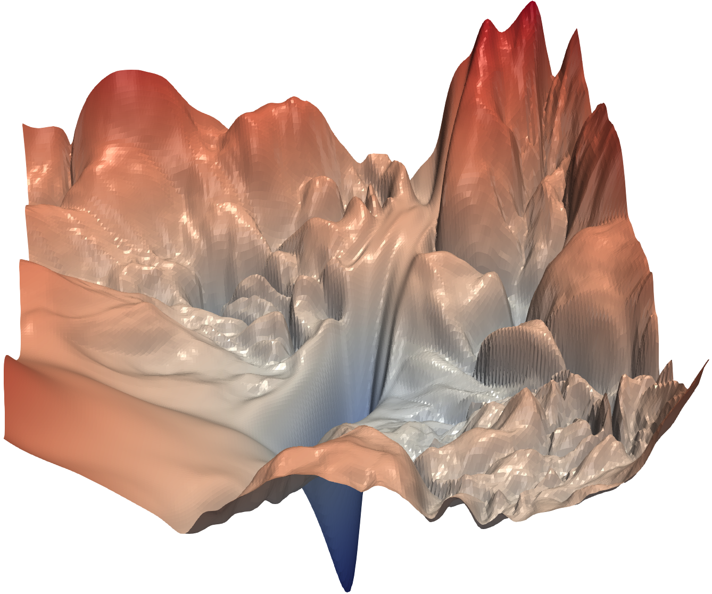
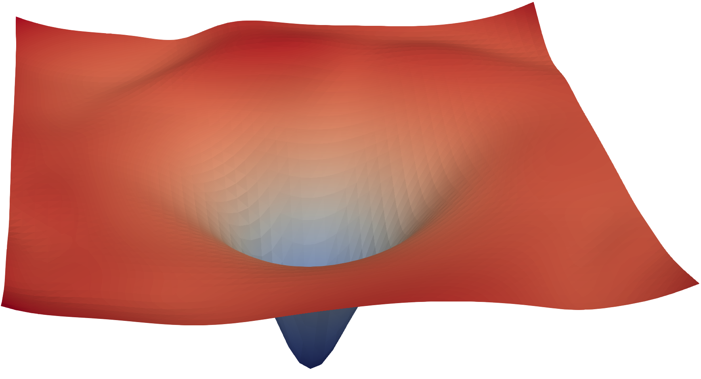

## From attention to a complete architecture {.overview-slide}

{.overview-image fig-alt="An original two-tower Transformer overview: position-aware token inputs flow upward through repeated encoder and decoder blocks, encoder memory crosses into the decoder, and the decoder produces an output distribution"}

::::::: {.overview-labels}
::: {.overview-label}
**POSITION**

Give tokens an order
:::
::: {.overview-label}
**TRANSFORM**

Process features deeply
:::
::: {.overview-label}
**STABILIZE**

Build safe depth
:::
::: {.overview-label}
**ENCODE**

Read in both directions
:::
::: {.overview-label}
**DECODE**

Generate without peeking
:::
::: {.overview-label}
**CONNECT**

Retrieve source memory
:::
:::::::

<div class="citation">Architecture journey informed by the [Stanford CS224N Transformer lecture](https://web.stanford.edu/class/cs224n/slides_w26/cs224n-2026-lecture05-transformers.pdf) and [The Illustrated Transformer](https://jalammar.github.io/illustrated-transformer/). Overview artwork is original.</div>

## What we will build

::: {.toc-route-vertical}
<div><b>1</b><strong>POSITION</strong><span>Give an unordered attention mechanism a sense of sequence.</span></div>
<div><b>2</b><strong>TRANSFORM FEATURES</strong><span>Add the position-wise feed-forward network.</span></div>
<div><b>3</b><strong>BUILD DEPTH SAFELY</strong><span>Preserve information with residual routes and normalization.</span></div>
<div><b>4</b><strong>THE ENCODER</strong><span>Stack bidirectional blocks into contextual representations.</span></div>
<div><b>5</b><strong>THE DECODER</strong><span>Turn masked context into next-token predictions.</span></div>
<div><b>6</b><strong>ENCODER + DECODER</strong><span>Connect both towers through cross-attention.</span></div>
<div><b>7</b><strong>THREE TRANSFORMER FAMILIES</strong><span>Relate encoder-only, decoder-only, and encoder–decoder designs.</span></div>
<div><b>8</b><strong>THE NEXT QUESTION</strong><span>Architecture moves information—but how does it learn language?</span></div>
:::

<div class="citation">The route begins at the unresolved questions from our Attention Mechanisms lecture and ends at the motivation for pretrained language models.</div>

## Attention can rearrange—but cannot detect the rearrangement

::: {.permutation-stage}
<svg viewBox="0 0 1320 485" role="img" aria-label="Two sentences contain the same three token embeddings in different orders. Self-attention preserves each ordering but has no independent position signal telling the orders apart.">
  <defs><marker id="perm-arrow" viewBox="0 0 10 10" refX="9" refY="5" markerWidth="6" markerHeight="6" orient="auto"><path d="M0 0 L10 5 L0 10 z"></path></marker></defs>
  <g class="perm-sentence sentence-a">
    <text class="perm-kicker" x="245" y="42">ORDER A</text>
    <g class="perm-token subject"><rect x="30" y="75" width="180" height="82" rx="13"></rect><text x="120" y="126">ALICE</text></g>
    <g class="perm-token verb"><rect x="230" y="75" width="180" height="82" rx="13"></rect><text x="320" y="126">THANKED</text></g>
    <g class="perm-token object"><rect x="430" y="75" width="180" height="82" rx="13"></rect><text x="520" y="126">BOB</text></g>
    <text class="perm-meaning" x="320" y="206">Alice performs the action</text>
  </g>
  <g class="fragment perm-sentence sentence-b" data-fragment-index="0">
    <text class="perm-kicker" x="1075" y="42">ORDER B</text>
    <g class="perm-token object"><rect x="750" y="75" width="180" height="82" rx="13"></rect><text x="840" y="126">BOB</text></g>
    <g class="perm-token verb"><rect x="950" y="75" width="180" height="82" rx="13"></rect><text x="1040" y="126">THANKED</text></g>
    <g class="perm-token subject"><rect x="1150" y="75" width="140" height="82" rx="13"></rect><text x="1220" y="126">ALICE</text></g>
    <text class="perm-meaning" x="1040" y="206">Bob performs the action</text>
  </g>
  <g class="fragment perm-attention" data-fragment-index="1">
    <rect x="440" y="270" width="440" height="116" rx="20"></rect>
    <text class="perm-attention-title" x="660" y="315">SELF-ATTENTION</text>
    <text class="perm-attention-note" x="660" y="355">same token vectors · same pairwise comparisons</text>
    <path d="M320 215 C320 255 430 285 440 310"></path><path d="M1040 215 C1040 255 890 285 880 310"></path>
  </g>
  <g class="fragment perm-result" data-fragment-index="2">
    <path d="M520 386 C465 432 405 445 330 445"></path><path d="M800 386 C855 432 915 445 990 445"></path>
    <text x="330" y="472">outputs follow order A</text><text x="990" y="472">outputs follow order B</text>
  </g>
</svg>
:::

::: {.fragment .permutation-rule data-fragment-index="3"}
<span>reorder inputs with $P$</span><b>$operatorname{Attn}(PX)=P,operatorname{Attn}(X)$</b><span>outputs are merely reordered</span>
:::

::: {.fragment .position-need data-fragment-index="4"}
Attention sees <b>which tokens are present</b> and how they match—but it needs another signal to know <b>where each token occurs</b>.
:::

<div class="citation">Self-attention without positional information is permutation equivariant; the Transformer therefore injects position representations into its inputs ([Stanford CS224N, Lecture 5](https://web.stanford.edu/class/cs224n/slides_w26/cs224n-2026-lecture05-transformers.pdf)).</div>

## Token embeddings need a position signal

::: {.embedding-position-lead}
A token embedding tells us <b>what</b> the token is—not <b>where</b> it occurs.
:::

::: {.embedding-position-equation}
$$
\boxed{\mathbf{z}_i=\mathbf{e}(\text{token}_i)+\mathbf{p}_i}
$$
:::

::: {.embedding-position-assembly}
<div class="assembly-token"><small>TOKEN IDENTITY</small><b>$\mathbf e(\text{token}_i)$</b><span>same word → same lexical vector</span></div>
<div class="assembly-plus">+</div>
<div class="assembly-position fragment" data-fragment-index="0"><small>POSITION</small><b>$\mathbf p_i$</b><span>different location → different position vector</span></div>
<div class="assembly-arrow fragment" data-fragment-index="1">→</div>
<div class="assembly-input fragment" data-fragment-index="1"><small>TRANSFORMER INPUT</small><b>$\mathbf z_i$</b><span>content and order arrive together</span></div>
:::

::: {.fragment .embedding-position-takeaway data-fragment-index="2"}
The vectors have the same dimension, so addition preserves one vector per token and changes none of the attention machinery.
:::

<div class="citation">The Transformer adds positional encodings to input embeddings before the first layer [Vaswani et al., 2017; [The Illustrated Transformer](https://jalammar.github.io/illustrated-transformer/)].</div>

## The same token now looks different in a different place

::: {.position-example-ribbon}
<small>KEEP THE WORD FIXED · MOVE ITS POSITION</small>
<strong>$\mathbf e_{\text{cats}}=[1.0,\ 0.0]$</strong>
:::

::::: {.position-example-comparison}
:::: {.example-sentence .first-sentence}
<div class="sentence-mini"><b>cats</b><span>chase</span><span>mice</span></div>
<small>CATS AT POSITION 1</small>

$$
\begin{aligned}
\mathbf z_1
  &= \mathbf e_{\text{cats}}+\mathbf p_1\\
  &= [1.0,0.0]+[0.1,0.0]\\
  &= \boxed{[1.1,0.0]}
\end{aligned}
$$
::::

:::: {.example-shift .fragment data-fragment-index="0"}
<span>same identity</span><b>≠</b><span>different input</span>
::::

:::: {.example-sentence .third-sentence .fragment data-fragment-index="0"}
<div class="sentence-mini"><span>mice</span><span>chase</span><b>cats</b></div>
<small>CATS AT POSITION 3</small>

$$
\begin{aligned}
\mathbf z_3
  &= \mathbf e_{\text{cats}}+\mathbf p_3\\
  &= [1.0,0.0]+[-0.1,0.1]\\
  &= \boxed{[0.9,0.1]}
\end{aligned}
$$
::::
:::::

::: {.fragment .position-vector-question data-fragment-index="1"}
We know how to inject position. But what information should the vectors $\mathbf p_1,\mathbf p_2,\ldots$ contain?
:::

<div class="citation">Because position is added before projection, the queries, keys, and values can become sensitive to both token identity and location.</div>

## Encode position with waves at different frequencies

:::: {.sinusoidal-layout}
::: {.sinusoidal-formula}
<small>FIXED SINUSOIDAL ENCODING</small>

$$
\begin{aligned}
PE(pos,2k)
  &=\sin\!\left(\frac{pos}{10000^{2k/d}}\right)\\[0.45em]
PE(pos,2k+1)
  &=\cos\!\left(\frac{pos}{10000^{2k/d}}\right)
\end{aligned}
$$

<div class="sinusoidal-reading">
<span><b>pos</b> selects the token location</span>
<span><b>k</b> selects a coordinate pair</span>
<span><b>d</b> is the embedding dimension</span>
</div>
:::

::: {.sinusoidal-graph}
<svg viewBox="0 0 650 430" role="img" aria-label="Sine and cosine position signals at three frequencies, from rapidly changing to slowly changing across token positions.">
  <line class="wave-axis" x1="55" y1="70" x2="625" y2="70"></line><line class="wave-axis" x1="55" y1="205" x2="625" y2="205"></line><line class="wave-axis" x1="55" y1="340" x2="625" y2="340"></line>
  <path class="wave sine fast" d="M55 70 C79 15 103 15 127 70 S175 125 199 70 S247 15 271 70 S319 125 343 70 S391 15 415 70 S463 125 487 70 S535 15 559 70 S607 125 625 70"></path>
  <path class="wave cosine fast fragment" data-fragment-index="0" d="M55 20 C79 20 103 120 127 120 S175 20 199 20 S247 120 271 120 S319 20 343 20 S391 120 415 120 S463 20 487 20 S535 120 559 120 S607 20 625 20"></path>
  <path class="wave sine medium" d="M55 205 C103 135 151 135 199 205 S295 275 343 205 S439 135 487 205 S583 275 625 205"></path>
  <path class="wave cosine medium fragment" data-fragment-index="0" d="M55 145 C103 145 151 265 199 265 S295 145 343 145 S439 265 487 265 S583 145 625 145"></path>
  <path class="wave sine slow" d="M55 340 C150 250 250 250 345 340 S535 430 625 340"></path>
  <path class="wave cosine slow fragment" data-fragment-index="0" d="M55 270 C150 270 250 410 345 410 S535 270 625 270"></path>
  <text class="wave-label" x="65" y="48">FAST CHANGE</text><text class="wave-label" x="65" y="183">MEDIUM CHANGE</text><text class="wave-label" x="65" y="318">SLOW CHANGE</text>
  <text class="wave-position-label" x="340" y="427">TOKEN POSITION →</text>
</svg>
:::
::::

::: {.fragment .sinusoidal-meaning data-fragment-index="1"}
Each position receives a distinctive pattern across dimensions; nearby positions have related patterns, while different frequencies expose distance at several scales.
:::

::: {.position-alternatives}
<small>OTHER POSITION STRATEGIES</small><span>learned absolute embeddings</span><span>relative position representations or biases</span><span>rotary position embeddings (RoPE)</span><span>linear attention biases (ALiBi)</span>
:::

<div class="citation">The fixed sine–cosine construction is from [Vaswani et al., 2017](https://arxiv.org/abs/1706.03762). Modern alternatives include learned, relative, rotary, and linear-bias approaches; here we focus on the classical sinusoidal formulation.</div>

## Position is solved—but attention still only mixes

::: {.mixing-limit-stage}
<svg viewBox="0 0 1320 460" role="img" aria-label="Position-aware token vectors pass through two stacked attention layers. Each layer mixes information across positions, but an unresolved feature transformation is still missing.">
  <defs><marker id="mix-arrow" viewBox="0 0 10 10" refX="9" refY="5" markerWidth="7" markerHeight="7" orient="auto"><path d="M0 0 L10 5 L0 10 z"></path></marker></defs>
  <g class="mix-inputs"><rect x="35" y="165" width="210" height="130" rx="18"></rect><text class="mix-kicker" x="140" y="205">POSITION-AWARE</text><text class="mix-symbol" x="140" y="258">Z</text></g>
  <path class="mix-flow" d="M245 230 H330"></path>
  <g class="mix-attention"><rect x="330" y="120" width="285" height="220" rx="22"></rect><text class="mix-kicker" x="472" y="172">ATTENTION 1</text><path d="M375 270 C420 175 525 175 570 270 M375 270 C430 225 515 225 570 270"></path><circle cx="375" cy="270" r="10"></circle><circle cx="472" cy="270" r="10"></circle><circle cx="570" cy="270" r="10"></circle><text class="mix-note" x="472" y="315">mix across positions</text></g>
  <path class="mix-flow fragment" data-fragment-index="0" d="M615 230 H700"></path>
  <g class="mix-attention fragment" data-fragment-index="0"><rect x="700" y="120" width="285" height="220" rx="22"></rect><text class="mix-kicker" x="842" y="172">ATTENTION 2</text><path d="M745 270 C790 175 895 175 940 270 M745 270 C800 225 885 225 940 270"></path><circle cx="745" cy="270" r="10"></circle><circle cx="842" cy="270" r="10"></circle><circle cx="940" cy="270" r="10"></circle><text class="mix-note" x="842" y="315">mix again</text></g>
  <path class="mix-flow fragment" data-fragment-index="1" d="M985 230 H1060"></path>
  <g class="mix-missing fragment" data-fragment-index="1"><rect x="1060" y="120" width="225" height="220" rx="22"></rect><text class="mix-question" x="1172" y="250">?</text><text class="mix-note" x="1172" y="315">transform features</text></g>
</svg>
:::

::: {.fragment .mixing-limit-rule data-fragment-index="2"}
<div><small>WHAT ATTENTION DOES</small><b>Move and combine information between positions</b></div>
<div><small>WHAT IS STILL MISSING</small><b>A position-wise nonlinear transformation of features</b></div>
:::

::: {.fragment .mlp-bridge data-fragment-index="3"}
What small neural network can transform every token independently between attention layers?
:::

<div class="citation">Self-attention supplies weighted mixtures but no elementwise nonlinearity; the Transformer follows it with a position-wise feed-forward network ([Stanford CS224N, Lecture 5](https://web.stanford.edu/class/cs224n/slides_w26/cs224n-2026-lecture05-transformers.pdf)).</div>

# Part II · Transform features {.section-slide}

## Attention communicates; it does not deeply process each message

::: {.mix-vs-transform-stage}
<svg viewBox="0 0 1320 500" role="img" aria-label="Attention first moves information between three token positions. A separate transformation then processes the features inside each resulting token vector.">
  <defs>
    <marker id="mvt-arrow" viewBox="0 0 10 10" refX="9" refY="5" markerWidth="7" markerHeight="7" orient="auto"><path d="M0 0 L10 5 L0 10 z"></path></marker>
    <marker id="mvt-inner-arrow" viewBox="0 0 10 10" refX="9" refY="5" markerUnits="userSpaceOnUse" markerWidth="9" markerHeight="9" orient="auto"><path d="M0 0 L10 5 L0 10 z"></path></marker>
  </defs>
  <g class="mvt-inputs"><rect x="30" y="80" width="155" height="90" rx="14"></rect><rect x="30" y="205" width="155" height="90" rx="14"></rect><rect x="30" y="330" width="155" height="90" rx="14"></rect><text x="107" y="135">z₁</text><text x="107" y="260">z₂</text><text x="107" y="385">z₃</text></g>
  <g class="mvt-mix"><rect x="315" y="65" width="300" height="370" rx="22"></rect><text class="mvt-kicker" x="465" y="112">MULTI-HEAD ATTENTION</text><path d="M185 125 C240 125 260 250 315 250 M185 250 H315 M185 375 C240 375 260 250 315 250"></path><path d="M185 125 C245 125 265 145 315 145 M185 250 C245 250 265 145 315 145 M185 375 C245 375 265 355 315 355"></path><text class="mvt-main" x="465" y="240">mix</text><text class="mvt-note" x="465" y="278">across token positions</text></g>
  <path class="mvt-flow" d="M615 250 H725"></path>
  <g class="fragment mvt-transform" data-fragment-index="0"><rect x="725" y="65" width="565" height="370" rx="22"></rect><text class="mvt-kicker" x="1007" y="112">POSITION-WISE FEED-FORWARD NETWORK</text><g class="feature-bars"><rect x="790" y="170" width="55" height="175"></rect><rect x="865" y="215" width="55" height="130"></rect><rect x="940" y="130" width="55" height="215"></rect><path d="M1015 237 H1060"></path><rect x="1080" y="130" width="55" height="215"></rect><rect x="1155" y="215" width="55" height="130"></rect><rect x="1230" y="170" width="55" height="175"></rect></g><text class="mvt-main" x="1007" y="398">transform within each vector</text></g>
</svg>
:::

:::: {.fragment .mix-vs-transform-rule data-fragment-index="1"}
::: {.mix-rule}
<small>ATTENTION</small>

**Who should communicate with whom?**
:::
::: {.transform-rule}
<small>FEED-FORWARD NETWORK</small>

**How should the retrieved features be transformed?**
:::
::::

<div class="citation">Self-attention routes and combines information across positions; the following feed-forward network independently processes each resulting position ([Stanford CS224N, Lecture 5](https://web.stanford.edu/class/cs224n/slides_w26/cs224n-2026-lecture05-transformers.pdf)).</div>

## The feed-forward network is a familiar two-layer MLP

::: {.classical-ffn-stage}
<svg viewBox="0 0 1320 520" role="img" aria-label="A conventional neural-network diagram: five input nodes connect to six red hidden nodes, ReLU produces six activated nodes, and a second set of weighted connections produces five output nodes.">
  <defs><marker id="ffn-stage-arrow" viewBox="0 0 10 10" refX="9" refY="5" markerUnits="userSpaceOnUse" markerWidth="10" markerHeight="10" orient="auto"><path d="M0 0 L10 5 L0 10 z"></path></marker></defs>
  <text class="ffn-stage-label" x="90" y="45">INPUT VECTOR</text><text class="ffn-stage-label" x="380" y="45">LINEAR 1 · EXPAND</text><text class="ffn-stage-label" x="635" y="45">NONLINEARITY</text><text class="ffn-stage-label" x="1015" y="45">LINEAR 2 · PROJECT</text><text class="ffn-stage-label" x="1210" y="45">OUTPUT</text>
  <g class="ffn-input-nodes"><circle cx="90" cy="105" r="21"></circle><circle cx="90" cy="180" r="21"></circle><circle cx="90" cy="255" r="21"></circle><circle cx="90" cy="330" r="21"></circle><circle cx="90" cy="405" r="21"></circle></g>
  <g class="ffn-first-edges"><path d="M112 105 L353 80 M112 105 L353 150 M112 180 L353 220 M112 255 L353 290 M112 330 L353 360 M112 405 L353 430 M112 180 L353 80 M112 255 L353 150 M112 330 L353 220 M112 405 L353 290"></path></g>
  <g class="fragment ffn-hidden-nodes" data-fragment-index="0"><circle cx="380" cy="80" r="24"></circle><circle cx="380" cy="150" r="24"></circle><circle cx="380" cy="220" r="24"></circle><circle cx="380" cy="290" r="24"></circle><circle cx="380" cy="360" r="24"></circle><circle cx="380" cy="430" r="24"></circle><text x="380" y="485">W₁x + b₁</text></g>
  <path class="fragment ffn-stage-flow" data-fragment-index="1" d="M415 255 H550"></path>
  <g class="fragment ffn-relu-gate" data-fragment-index="1"><rect x="550" y="150" width="170" height="210" rx="22"></rect><text class="relu-symbol" x="635" y="245">ReLU</text><text class="relu-rule" x="635" y="290">max(0, ·)</text></g>
  <path class="fragment ffn-stage-flow" data-fragment-index="1" d="M720 255 H790"></path>
  <g class="fragment ffn-activated-nodes" data-fragment-index="1"><circle cx="820" cy="80" r="24"></circle><circle cx="820" cy="150" r="24"></circle><circle cx="820" cy="220" r="24"></circle><circle cx="820" cy="290" r="24"></circle><circle cx="820" cy="360" r="24"></circle><circle cx="820" cy="430" r="24"></circle><text x="820" y="485">h = ReLU(W₁x + b₁)</text></g>
  <g class="fragment ffn-second-edges" data-fragment-index="2"><path d="M847 80 L1187 105 M847 150 L1187 105 M847 220 L1187 180 M847 290 L1187 255 M847 360 L1187 330 M847 430 L1187 405 M847 80 L1187 255 M847 150 L1187 330 M847 290 L1187 105 M847 360 L1187 180 M847 430 L1187 330"></path></g>
  <g class="fragment ffn-output-nodes" data-fragment-index="2"><circle cx="1210" cy="105" r="21"></circle><circle cx="1210" cy="180" r="21"></circle><circle cx="1210" cy="255" r="21"></circle><circle cx="1210" cy="330" r="21"></circle><circle cx="1210" cy="405" r="21"></circle><text x="1210" y="465">W₂h + b₂</text></g>
</svg>
:::

::: {.fragment .classical-ffn-equation data-fragment-index="3"}
$$
\operatorname{FFN}(x)=W_2\,\operatorname{ReLU}(W_1x+b_1)+b_2
$$
:::

<div class="citation">The Transformer applies this same two-layer MLP independently to every token position; the original formulation uses ReLU [Vaswani et al., 2017].</div>

## Unfold one Transformer stack

:::: {.unfolding-layout}
::: {.unfolding-notes}
<small>THE MAIN IDEA</small>

- **MHA communicates:** each token retrieves information from other positions.
- **FFN transforms:** the same small MLP processes every token independently.
- The two operations **alternate** throughout the stack.
- Every layer keeps the sequence length and model width unchanged.

::: {.unfolding-summary}
One block learns one round of communication followed by one round of feature transformation.
:::
:::

::: {.unfolding-stack}
<div class="unfold-input"><small>POSITION-AWARE TOKEN VECTORS</small><b>$Z^{(0)}$</b></div>
<div class="unfold-arrow">↓</div>
<div class="unfold-block first-block">
  <span><small>COMMUNICATE</small><b>MULTI-HEAD ATTENTION</b></span>
  <i>↓</i>
  <span><small>TRANSFORM</small><b>FEED-FORWARD NETWORK</b></span>
</div>
<div class="unfold-arrow fragment" data-fragment-index="0">↓</div>
<div class="unfold-block second-block fragment" data-fragment-index="0">
  <span><small>COMMUNICATE AGAIN</small><b>MULTI-HEAD ATTENTION</b></span>
  <i>↓</i>
  <span><small>TRANSFORM AGAIN</small><b>FEED-FORWARD NETWORK</b></span>
</div>
<div class="unfold-ellipsis fragment" data-fragment-index="1">⋮</div>
<div class="unfold-output fragment" data-fragment-index="1"><small>DEEP CONTEXTUAL REPRESENTATIONS</small><b>$Z^{(L)}$</b></div>
:::
::::

::: {.fragment .unfolding-question data-fragment-index="2"}
The computation is clear—but what prevents information from degrading as this stack becomes deep?
:::

<div class="citation">Attention and the position-wise FFN are the two computational sublayers repeated through the Transformer; residual connections and normalization make that repetition trainable.</div>

## During generation, the future must remain invisible

:::: {.causal-mask-visual}
::: {.causal-mask-example}
<small>NEXT-TOKEN TRAINING EXAMPLE</small>

<div class="mask-token-strip"><span>The</span><span>cat</span><span>sat</span><span>down</span></div>

<p>Each row is the token asking a question. Each column is a token it could inspect.</p>
:::

::: {.causal-mask-table-wrap}
<table class="causal-mask-table" aria-label="Causal attention mask for the tokens The cat sat down">
<thead><tr><th>query ↓ / key →</th><th>The</th><th>cat</th><th>sat</th><th>down</th></tr></thead>
<tbody>
<tr><th>The</th><td class="visible-cell">✓</td><td class="future-cell fragment" data-fragment-index="0">−∞</td><td class="future-cell fragment" data-fragment-index="0">−∞</td><td class="future-cell fragment" data-fragment-index="0">−∞</td></tr>
<tr><th>cat</th><td class="visible-cell">✓</td><td class="visible-cell">✓</td><td class="future-cell fragment" data-fragment-index="0">−∞</td><td class="future-cell fragment" data-fragment-index="0">−∞</td></tr>
<tr><th>sat</th><td class="visible-cell">✓</td><td class="visible-cell">✓</td><td class="visible-cell">✓</td><td class="future-cell fragment" data-fragment-index="0">−∞</td></tr>
<tr><th>down</th><td class="visible-cell">✓</td><td class="visible-cell">✓</td><td class="visible-cell">✓</td><td class="visible-cell">✓</td></tr>
</tbody>
</table>

<div class="fragment mask-legend" data-fragment-index="0"><b>Allowed:</b> current and earlier positions <span></span> <b>Blocked:</b> future positions</div>
:::
::::

::: {.fragment .causal-mask-takeaway data-fragment-index="1"}
The triangular mask lets every position train in parallel—without revealing the answer it is supposed to predict.
:::

<div class="citation">Decoder self-attention masks all connections to subsequent positions, preserving the autoregressive constraint ([Vaswani et al., 2017](https://arxiv.org/abs/1706.03762)).</div>

## Implement masking before the softmax

::: {.mask-implementation}
<div class="mask-step score-step">
<small>1 · COMPUTE SCORES</small>

$$S=\frac{QK^\top}{\sqrt{d_k}}$$

<span>One score for every query–key pair.</span>
</div>

<div class="mask-step mask-step-center fragment" data-fragment-index="0">
<small>2 · ADD THE MASK</small>

$$
M_{ij}=\begin{cases}
0 & j\le i\\
-\infty & j>i
\end{cases}
$$

<span>Future scores become $-\infty$.</span>
</div>

<div class="mask-step probability-step fragment" data-fragment-index="1">
<small>3 · NORMALIZE</small>

$$A=\operatorname{softmax}(S+M)$$

<span>Because $e^{-\infty}=0$, blocked positions receive exactly zero attention.</span>
</div>
:::

::: {.fragment .mask-code data-fragment-index="2"}
```python
scores = Q @ K.transpose(-2, -1) / sqrt(d_k)
scores = scores.masked_fill(causal_mask == 0, float("-inf"))
attention = softmax(scores, dim=-1)
output = attention @ V
```
:::

::: {.fragment .mask-check data-fragment-index="3"}
**Implementation check:** apply the mask to the scores—not to the probabilities—and do it **before** softmax.
:::

<div class="citation">The mask is added to scaled dot-product scores before normalization; practical implementations commonly use an upper-triangular boolean mask with masked logits filled by $-\infty$.</div>

## The ingredients work—but depth still needs a safe route

:::: {.necessities-layout}
::: {.necessities-list}
<small>OUR SELF-ATTENTION BUILDING BLOCK</small>

- **Self-attention** moves information between token positions.
- **Position representations** tell an otherwise unordered operation where tokens occur.
- **Nonlinearities** enter through the position-wise feed-forward network.
- **Masking** prevents future information from leaking into a prediction.

::: {.fragment .residual-need data-fragment-index="0"}
**One more requirement for depth:** preserve a direct path for both information and gradients.

$$x \longrightarrow x + \operatorname{Sublayer}(x)$$
:::
:::

::: {.necessities-architecture}
<svg viewBox="0 0 520 650" role="img" aria-label="A tall language-model path: positioned embeddings form queries, keys, and values for masked multi-head attention, followed by a feed-forward network, linear projection, softmax, and next-token probabilities. Gray residual routes bypass the attention and feed-forward sublayers.">
  <defs><marker id="necessity-arrow" viewBox="0 0 10 10" refX="9" refY="5" markerWidth="4" markerHeight="4" orient="auto"><path d="M0 0 L10 5 L0 10 z"></path></marker><marker id="residual-arrow" viewBox="0 0 10 10" refX="9" refY="5" markerWidth="4" markerHeight="4" orient="auto"><path d="M0 0 L10 5 L0 10 z"></path></marker></defs>
  <text class="architecture-caption" x="260" y="20">THE PATH WE HAVE BUILT</text>
  <g class="probability-output"><text x="260" y="47">NEXT-TOKEN PROBABILITIES</text><rect x="170" y="61" width="28" height="18"></rect><rect x="211" y="54" width="28" height="25"></rect><rect x="252" y="38" width="28" height="41"></rect><rect x="293" y="58" width="28" height="21"></rect><rect x="334" y="68" width="28" height="11"></rect></g>
  <path class="architecture-main-arrow" d="M260 105 V82"></path>
  <g class="architecture-block softmax-block"><rect x="145" y="105" width="230" height="48" rx="9"></rect><text x="260" y="136">SOFTMAX</text></g>
  <path class="architecture-main-arrow" d="M260 183 V153"></path>
  <g class="architecture-block linear-block"><rect x="145" y="183" width="230" height="48" rx="9"></rect><text x="260" y="214">LINEAR</text></g>
  <path class="architecture-main-arrow" d="M260 270 V231"></path>
  <g class="architecture-block ffn-block"><rect x="110" y="270" width="300" height="70" rx="12"></rect><text x="260" y="313">FFN · ReLU</text></g>
  <path class="architecture-main-arrow" d="M260 405 V340"></path>
  <g class="architecture-block attention-block"><rect x="110" y="405" width="300" height="78" rx="12"></rect><text x="260" y="438">MASKED</text><text x="260" y="467">MULTI-HEAD ATTENTION</text></g>
  <g class="qkv-paths"><path d="M195 580 V483"></path><path d="M260 580 V483"></path><path d="M325 580 V483"></path><text x="195" y="535">Q</text><text x="260" y="535">K</text><text x="325" y="535">V</text></g>
  <g class="architecture-block input-block"><rect x="110" y="580" width="300" height="55" rx="10"></rect><text x="260" y="603">TOKEN EMBEDDINGS</text><text x="260" y="624">+ POSITION</text></g>
  <g class="fragment architecture-residuals" data-fragment-index="0">
    <path d="M110 608 H52 V375 H260"></path>
    <path d="M260 375 H458 V246 H260"></path>
    <text x="43" y="490" transform="rotate(-90 43 490)">DIRECT INFORMATION PATH</text>
    <text x="469" y="310" transform="rotate(-90 469 310)">BETTER GRADIENT PATH</text>
  </g>
</svg>
:::
::::

<div class="citation">The four necessities summarize slide 53 of [Stanford CS224N, Lecture 5](https://web.stanford.edu/class/cs224n/slides_w26/cs224n-2026-lecture05-transformers.pdf); residual connections add a direct identity path around each sublayer.</div>

## One attention pattern can recover one relationship

::: {.single-head-recall}
<svg viewBox="0 0 1320 535" role="img" aria-label="For the sentence The chef who praised the apprentice served dinner, the word served attends most strongly to chef, recovering its subject across a relative clause.">
  <defs><marker id="head-one-arrow" viewBox="0 0 10 10" refX="9" refY="5" markerWidth="4" markerHeight="4" orient="auto"><path d="M0 0 L10 5 L0 10 z"></path></marker></defs>
  <text class="mha-recall-kicker" x="660" y="34">QUERY TOKEN: “SERVED”</text>
  <text class="mha-recall-context" x="660" y="72">Which earlier word tells us who performed the action?</text>
  <text class="mha-recall-context" x="660" y="102">The relative clause places another noun between the subject and its verb.</text>
  <g class="mha-arc head-subject-arc"><path d="M1020 222 C930 72 380 72 245 222"></path><text x="635" y="132">subject relation</text></g>
  <g class="mha-token-row">
    <g><rect x="25" y="225" width="130" height="72" rx="10"></rect><text x="90" y="270">The</text></g>
    <g><rect x="180" y="225" width="130" height="72" rx="10"></rect><text x="245" y="270">chef</text></g>
    <g><rect x="335" y="225" width="130" height="72" rx="10"></rect><text x="400" y="270">who</text></g>
    <g><rect x="490" y="225" width="130" height="72"></rect><text x="555" y="270">praised</text></g>
    <g><rect x="645" y="225" width="130" height="72"></rect><text x="710" y="270">the</text></g>
    <g><rect x="800" y="225" width="130" height="72"></rect><text x="865" y="270">apprentice</text></g>
    <g class="query-token"><rect x="955" y="225" width="130" height="72"></rect><text x="1020" y="270">served</text></g>
    <g><rect x="1110" y="225" width="130" height="72"></rect><text x="1175" y="270">dinner</text></g>
  </g>
  <g class="mha-probability-label"><text x="90" y="348">.03</text><text class="strong-score" x="245" y="348">.52</text><text x="400" y="348">.05</text><text x="555" y="348">.08</text><text x="710" y="348">.03</text><text x="865" y="348">.05</text><text x="1020" y="348">.10</text><text x="1175" y="348">.14</text></g>
  <g class="mha-probability-bars"><rect x="66" y="453" width="48" height="6"></rect><rect class="strong-bar" x="221" y="355" width="48" height="104"></rect><rect x="376" y="449" width="48" height="10"></rect><rect x="531" y="443" width="48" height="16"></rect><rect x="686" y="453" width="48" height="6"></rect><rect x="841" y="449" width="48" height="10"></rect><rect x="996" y="439" width="48" height="20"></rect><rect x="1151" y="431" width="48" height="28"></rect><path d="M40 459 H1220"></path></g>
</svg>
:::

::: {.fragment .mha-recall-question data-fragment-index="0"}
This head finds **who served**. But should the same probability distribution also encode **what was served**?
:::

<div class="citation">Adapted from the single-head hypothetical example on slide 55 of [Stanford CS224N, Lecture 5](https://web.stanford.edu/class/cs224n/slides_w26/cs224n-2026-lecture05-transformers.pdf); sentence and scores are original.</div>

## Another head can recover another relationship

::: {.second-head-recall}
<svg viewBox="0 0 1320 650" role="img" aria-label="Two aligned attention diagrams for the same sentence and query word served. Head one emphasizes chef as the subject, while head two emphasizes dinner as the object.">
  <defs><marker id="compare-head-one-arrow" viewBox="0 0 10 10" refX="9" refY="5" markerWidth="4" markerHeight="4" orient="auto"><path d="M0 0 L10 5 L0 10 z"></path></marker><marker id="compare-head-two-arrow" viewBox="0 0 10 10" refX="9" refY="5" markerWidth="4" markerHeight="4" orient="auto"><path d="M0 0 L10 5 L0 10 z"></path></marker></defs>
  <rect class="head-band head-one-band" x="18" y="15" width="1284" height="292" rx="18"></rect>
  <text class="comparison-head-label head-one-label" x="60" y="52">HEAD 1 · WHO SERVED?</text>
  <g class="mha-arc comparison-head-one"><path d="M1020 129 C900 35 390 35 245 129"></path><text x="635" y="74">SUBJECT</text></g>
  <g class="mha-token-row compact-token-row">
    <g><rect x="25" y="130" width="130" height="55" rx="9"></rect><text x="90" y="165">The</text></g><g class="subject-token"><rect x="180" y="130" width="130" height="55" rx="9"></rect><text x="245" y="165">chef</text></g><g><rect x="335" y="130" width="130" height="55" rx="9"></rect><text x="400" y="165">who</text></g><g><rect x="490" y="130" width="130" height="55" rx="9"></rect><text x="555" y="165">praised</text></g><g><rect x="645" y="130" width="130" height="55" rx="9"></rect><text x="710" y="165">the</text></g><g><rect x="800" y="130" width="130" height="55" rx="9"></rect><text x="865" y="165">apprentice</text></g><g class="query-token"><rect x="955" y="130" width="130" height="55" rx="9"></rect><text x="1020" y="165">served</text></g><g><rect x="1110" y="130" width="130" height="55" rx="9"></rect><text x="1175" y="165">dinner</text></g>
  </g>
  <g class="comparison-probabilities head-one-probabilities"><text x="90" y="218">.03</text><text class="strong-score" x="245" y="218">.52</text><text x="400" y="218">.05</text><text x="555" y="218">.08</text><text x="710" y="218">.03</text><text x="865" y="218">.05</text><text x="1020" y="218">.10</text><text x="1175" y="218">.14</text><rect x="66" y="274" width="48" height="4"></rect><rect class="strong-bar" x="221" y="226" width="48" height="52"></rect><rect x="376" y="273" width="48" height="5"></rect><rect x="531" y="270" width="48" height="8"></rect><rect x="686" y="275" width="48" height="3"></rect><rect x="841" y="273" width="48" height="5"></rect><rect x="996" y="268" width="48" height="10"></rect><rect x="1151" y="264" width="48" height="14"></rect><path d="M40 278 H1220"></path></g>
  <rect class="head-band head-two-band" x="18" y="327" width="1284" height="292" rx="18"></rect>
  <text class="comparison-head-label head-two-label" x="60" y="364">HEAD 2 · WHAT WAS SERVED?</text>
  <g class="mha-arc comparison-head-two"><path d="M1020 441 C1055 355 1125 355 1175 441"></path><text x="1100" y="386">OBJECT</text></g>
  <g class="mha-token-row compact-token-row">
    <g><rect x="25" y="442" width="130" height="55" rx="9"></rect><text x="90" y="477">The</text></g><g><rect x="180" y="442" width="130" height="55" rx="9"></rect><text x="245" y="477">chef</text></g><g><rect x="335" y="442" width="130" height="55" rx="9"></rect><text x="400" y="477">who</text></g><g><rect x="490" y="442" width="130" height="55" rx="9"></rect><text x="555" y="477">praised</text></g><g><rect x="645" y="442" width="130" height="55" rx="9"></rect><text x="710" y="477">the</text></g><g><rect x="800" y="442" width="130" height="55" rx="9"></rect><text x="865" y="477">apprentice</text></g><g class="query-token"><rect x="955" y="442" width="130" height="55" rx="9"></rect><text x="1020" y="477">served</text></g><g class="object-token"><rect x="1110" y="442" width="130" height="55" rx="9"></rect><text x="1175" y="477">dinner</text></g>
  </g>
  <g class="comparison-probabilities head-two-probabilities"><text x="90" y="530">.02</text><text x="245" y="530">.05</text><text x="400" y="530">.03</text><text x="555" y="530">.07</text><text x="710" y="530">.04</text><text x="865" y="530">.05</text><text x="1020" y="530">.12</text><text class="strong-score" x="1175" y="530">.62</text><rect x="66" y="586" width="48" height="2"></rect><rect x="221" y="583" width="48" height="5"></rect><rect x="376" y="585" width="48" height="3"></rect><rect x="531" y="581" width="48" height="7"></rect><rect x="686" y="584" width="48" height="4"></rect><rect x="841" y="583" width="48" height="5"></rect><rect x="996" y="576" width="48" height="12"></rect><rect class="strong-bar" x="1151" y="526" width="48" height="62"></rect><path d="M40 588 H1220"></path></g>
</svg>
:::

<div class="citation">Following the multi-head motivation of slide 56 in [Stanford CS224N, Lecture 5](https://web.stanford.edu/class/cs224n/slides_w26/cs224n-2026-lecture05-transformers.pdf): each head has its own learned $Q$, $K$, and $V$ projections and may therefore attend differently.</div>

## Residual connections reshape the optimization problem

:::: {.residual-explanation-layout}
::: {.residual-explanation}
<small>THE IDENTITY PATH</small>

$$x^{(\ell)}=x^{(\ell-1)}+F(x^{(\ell-1)})$$

- The sublayer learns only the **correction** $F(x)$.
- If that correction is not yet useful, the block can remain close to the **identity function**.
- During backpropagation, the skip contributes a direct derivative of **1**.

::: {.residual-gradient}
$$\frac{\partial x^{(\ell)}}{\partial x^{(\ell-1)}}=I+\frac{\partial F}{\partial x^{(\ell-1)}}$$
:::
:::

::: {.loss-landscape-comparison}
<figure class="landscape-panel rough-landscape">
<figcaption>WITHOUT SKIP CONNECTIONS</figcaption>

</figure>
<figure class="landscape-panel smooth-landscape">
<figcaption>WITH SKIP CONNECTIONS</figcaption>

</figure>
:::
::::

<div class="citation">Loss surfaces of ResNet-56 with and without skip connections, reproduced from Figure 1 of [Li et al., 2018, “Visualizing the Loss Landscape of Neural Nets”](https://papers.nips.cc/paper/7875-visualizing-the-loss-landscape-of-neural-nets.pdf). These are 2D parameter-space projections, not the complete high-dimensional surface.</div>

## LayerNorm controls each token’s feature scale

:::: {.layernorm-concept-layout}
::: {.layernorm-formulas}
<small>ONE TOKEN · $x\in\mathbb{R}^{d}$</small>

$$\mu=\frac{1}{d}\sum_{j=1}^{d}x_j$$

$$\sigma^2=\frac{1}{d}\sum_{j=1}^{d}(x_j-\mu)^2$$

$$\widehat{x}_j=\frac{x_j-\mu}{\sqrt{\sigma^2+\epsilon}}$$

::: {.fragment .layernorm-affine data-fragment-index="0"}
$$y_j=\gamma_j\widehat{x}_j+\beta_j$$

<span>$\gamma,\beta\in\mathbb{R}^{d}$ are learned.</span>
:::

::: {.layernorm-axis-note}
Statistics are computed across the **feature axis of each token independently**.
:::
:::

::: {.layernorm-scale-visual}
<svg viewBox="0 0 760 590" role="img" aria-label="A three-dimensional tensor with batch, token, and feature axes. One token's full feature row is highlighted, showing that LayerNorm reduces over the feature dimension to produce one mean and variance for every batch and token position.">
  <defs><marker id="ln-scale-arrow" viewBox="0 0 10 10" refX="9" refY="5" markerWidth="4" markerHeight="4" orient="auto"><path d="M0 0 L10 5 L0 10 z"></path></marker></defs>
  <text class="ln-visual-heading" x="260" y="35">ACTIVATION TENSOR X</text><text class="ln-shape" x="260" y="62">shape: B × T × d</text>
  <g class="ln-tensor-back"><rect x="105" y="105" width="360" height="280"></rect><rect x="135" y="82" width="360" height="280"></rect></g>
  <g class="ln-tensor-front"><rect x="75" y="128" width="360" height="280"></rect><path d="M135 128 V408 M195 128 V408 M255 128 V408 M315 128 V408 M375 128 V408 M75 198 H435 M75 268 H435 M75 338 H435"></path></g>
  <g class="ln-feature-fiber"><rect x="75" y="268" width="360" height="70"></rect><path d="M135 268 V338 M195 268 V338 M255 268 V338 M315 268 V338 M375 268 V338"></path><text x="255" y="311">one token vector x[b,t,:]</text></g>
  <g class="ln-tensor-axes"><path d="M75 438 H435"></path><text x="255" y="468">FEATURES · d</text><path d="M48 408 V128"></path><text x="25" y="268" transform="rotate(-90 25 268)">TOKENS · T</text><path d="M450 120 L505 78"></path><text x="520" y="75">BATCH · B</text></g>
  <g class="ln-reduction-arrow"><path d="M445 303 H535"></path><text x="490" y="282">reduce over d</text></g>
  <g class="ln-statistics"><text class="ln-visual-heading" x="635" y="126">ONE PAIR PER TOKEN</text><rect x="548" y="155" width="75" height="255" rx="12"></rect><rect x="647" y="155" width="75" height="255" rx="12"></rect><path d="M548 218 H623 M548 281 H623 M548 344 H623 M647 218 H722 M647 281 H722 M647 344 H722"></path><text x="585" y="190">μ</text><text x="684" y="190">σ²</text><text x="585" y="253">μ</text><text x="684" y="253">σ²</text><text x="585" y="316">μ</text><text x="684" y="316">σ²</text><text x="585" y="379">μ</text><text x="684" y="379">σ²</text><text class="ln-shape" x="635" y="445">each has shape B × T × 1</text></g>
  <g class="ln-kept-axes"><text x="635" y="493">B and T stay separate</text><text x="635" y="523">only d is collapsed</text></g>
</svg>
:::
::::

::: {.pause-panel .layernorm-compact-pause}
<small>PAUSE</small> For $x=[1,\;2,\;3]$, with $\gamma=\mathbf{1}$ and $\beta=\mathbf{0}$, find $\mu$, $\sigma^2$, and $\operatorname{LN}(x)$. Ignore $\epsilon$.
:::

## LayerNorm makes feature scale comparable

::: {.layernorm-worked}
<div class="ln-step"><small>1 · MEAN</small><span>$$\mu=\frac{1+2+3}{3}=2$$</span></div>
<div class="ln-step"><small>2 · VARIANCE</small><span>$$\sigma^2=\frac{(1-2)^2+(2-2)^2+(3-2)^2}{3}=\frac{2}{3}$$</span></div>
<div class="ln-step result-step"><small>3 · NORMALIZE</small><span>$$\operatorname{LN}(x)=\frac{[1,2,3]-2}{\sqrt{2/3}}\approx[-1.22,\;0,\;1.22]$$</span></div>
:::

:::: {.layernorm-inspection}
::: {.ln-before}
<small>BEFORE</small>

$[1,\;2,\;3]$
:::
::: {.ln-after}
<small>AFTER</small>

$[-1.22,\;0,\;1.22]$
:::
::: {.ln-checks}
<span>mean $\approx 0$</span><span>variance $\approx 1$</span>
:::
::::

::: {.fragment .ln-learned-affine data-fragment-index="0"}
The learned vectors $\gamma$ and $\beta$ can then rescale and shift each feature; normalization does not force every layer to remain standardized.
:::

<div class="citation">Layer normalization computes statistics within each token representation and then applies learned elementwise gain and bias ([Ba et al., 2016](https://arxiv.org/abs/1607.06450)).</div>

## LayerNorm in PyTorch: explicit and predefined

:::: {.layernorm-code-implementation}
::: {.layernorm-code-card .manual-layernorm}
<small>FROM THE EQUATIONS</small>

```python
import torch
from torch import nn

def layer_norm(x, gamma, beta, eps=1e-5):
    mean = x.mean(dim=-1, keepdim=True)
    var = x.var(
        dim=-1, keepdim=True, unbiased=False
    )
    x_hat = (x - mean) * torch.rsqrt(var + eps)
    return gamma * x_hat + beta

gamma = nn.Parameter(torch.ones(d_model))
beta  = nn.Parameter(torch.zeros(d_model))
y = layer_norm(x, gamma, beta)
```
:::

::: {.layernorm-code-card .builtin-layernorm}
<small>THE `nn` MODULE</small>

```python
import torch
from torch import nn

# x.shape == (batch, tokens, d_model)
norm = nn.LayerNorm(
    normalized_shape=d_model,
    eps=1e-5,
    elementwise_affine=True,
)

y = norm(x)

assert y.shape == x.shape
```

<div class="builtin-meaning"><code>normalized_shape=d_model</code> normalizes the <b>last axis</b>, then learns one γ and β per feature.</div>
:::
::::

::: {.layernorm-code-axis}
<span>$X: B\times T\times d$</span><b>normalize `dim=-1`</b><span>$Y: B\times T\times d$</span>
:::

<div class="citation">PyTorch `nn.LayerNorm(d_model)` normalizes over the final dimension, uses the biased variance estimator (`unbiased=False`), and applies learnable elementwise affine parameters by default. [PyTorch LayerNorm documentation](https://docs.pytorch.org/docs/stable/generated/torch.nn.LayerNorm.html).</div>

## The classical Transformer wraps each sublayer with Add & Norm

:::: {.addnorm-layout}
::: {.addnorm-notes}
<small>POST-NORM · ORIGINAL TRANSFORMER</small>

- A residual path carries $x$ around the sublayer.
- The two paths are **added**.
- LayerNorm stabilizes the combined representation.
- The pattern is applied after both **MHA** and the **FFN**.

::: {.addnorm-rule}
$$\operatorname{LayerNorm}\!\left(x+\operatorname{Sublayer}(x)\right)$$
:::
:::

::: {.addnorm-diagram}
<svg viewBox="0 0 700 610" role="img" aria-label="A classical post-norm Transformer block: input passes through multi-head attention and Add and Norm, then through a feed-forward network and a second Add and Norm, with a residual route around each sublayer.">
  <defs><marker id="addnorm-arrow" viewBox="0 0 10 10" refX="9" refY="5" markerUnits="userSpaceOnUse" markerWidth="8" markerHeight="8" orient="auto"><path d="M0 0 L10 5 L0 10 z"></path></marker></defs>
  <g class="addnorm-box input"><rect x="220" y="535" width="300" height="54" rx="10"></rect><text x="370" y="570">INPUT x</text></g>
  <path class="addnorm-main" d="M370 535 V470"></path>
  <g class="addnorm-box mha"><rect x="180" y="390" width="380" height="80" rx="12"></rect><text x="370" y="439">MULTI-HEAD ATTENTION</text></g>
  <path class="addnorm-main" d="M370 390 V330"></path>
  <path class="addnorm-skip" d="M370 520 H95 V300 H205"></path>
  <g class="addnorm-box norm"><rect x="210" y="270" width="320" height="60" rx="30"></rect><text x="370" y="307">ADD &amp; NORM</text></g>
  <path class="addnorm-main" d="M370 270 V205"></path>
  <g class="addnorm-box ffn"><rect x="180" y="125" width="380" height="80" rx="12"></rect><text x="370" y="174">FEED-FORWARD NETWORK</text></g>
  <path class="addnorm-main" d="M370 125 V65"></path>
  <path class="addnorm-skip" d="M370 245 H620 V35 H535"></path>
  <g class="addnorm-box norm"><rect x="210" y="5" width="320" height="60" rx="30"></rect><text x="370" y="42">ADD &amp; NORM</text></g>
</svg>
:::
::::

::: {.addnorm-synthesis}
Residuals preserve a route through depth; LayerNorm controls the representation carried along that route.
:::

<div class="citation">The original Transformer uses post-norm residual sublayers, commonly summarized as “Add &amp; Norm” ([Vaswani et al., 2017](https://arxiv.org/abs/1706.03762)).</div>

## A Transformer decoder repeats one complete block

::::: {.decoder-stack-summary}
:::: {.decoder-stack-notes}
<small>THE COMPLETE DECODER</small>

1. A Transformer decoder is a **stack of $L$ decoder blocks**.
2. Every block contains:

   - masked multi-head self-attention,
   - residual connection + LayerNorm,
   - position-wise FFN,
   - residual connection + LayerNorm.
3. The same architecture repeats, but **each layer has its own learned parameters**.
4. Linear projection and softmax convert the final state into next-token probabilities.

::: {.decoder-stack-rule}
$$Z^{(\ell)}=\operatorname{DecoderBlock}_{\ell}(Z^{(\ell-1)})$$
:::
::::

:::: {.decoder-plate-diagram}
<svg viewBox="0 0 820 680" role="img" aria-label="A probabilistic graphical model style plate encloses a decoder block repeated from layer one through layer L. Each block contains masked multi-head attention, Add and Norm, a feed-forward network, and another Add and Norm. Positioned target embeddings enter below; final states feed linear projection and softmax above.">
  <defs><marker id="decoder-plate-arrow" viewBox="0 0 10 10" refX="9" refY="5" markerUnits="userSpaceOnUse" markerWidth="8" markerHeight="8" orient="auto"><path d="M0 0 L10 5 L0 10 z"></path></marker></defs>
  <g class="decoder-output-head"><rect x="245" y="18" width="330" height="54" rx="10"></rect><text x="410" y="51">LINEAR + SOFTMAX</text><path d="M410 110 V72"></path><text class="decoder-prob-label" x="410" y="12">NEXT-TOKEN PROBABILITIES</text></g>
  <g class="decoder-plate">
    <rect x="88" y="105" width="644" height="475" rx="24"></rect>
    <text class="plate-title" x="118" y="140">DECODER BLOCK</text><text class="plate-index" x="685" y="555">ℓ = 1, …, L</text>
    <g class="decoder-layer-ghost"><rect x="190" y="165" width="440" height="330" rx="18"></rect><rect x="174" y="181" width="440" height="330" rx="18"></rect></g>
    <g class="decoder-layer-template"><rect x="158" y="197" width="440" height="330" rx="18"></rect>
      <g class="decoder-component masked"><rect x="205" y="438" width="346" height="55" rx="10"></rect><text x="378" y="472">MASKED MULTI-HEAD ATTENTION</text></g>
      <path class="decoder-main-flow" d="M378 438 V400"></path>
      <g class="decoder-component norm"><rect x="245" y="355" width="266" height="45" rx="22"></rect><text x="378" y="384">ADD &amp; NORM</text></g>
      <path class="decoder-main-flow" d="M378 355 V315"></path>
      <g class="decoder-component ffn"><rect x="205" y="265" width="346" height="50" rx="10"></rect><text x="378" y="297">POSITION-WISE FFN</text></g>
      <path class="decoder-main-flow" d="M378 265 V242"></path>
      <g class="decoder-component norm"><rect x="245" y="197" width="266" height="45" rx="22"></rect><text x="378" y="226">ADD &amp; NORM</text></g>
      <path class="decoder-residual" d="M205 466 H178 V377 H240"></path><path class="decoder-residual" d="M378 337 H575 V219 H516"></path>
    </g>
  </g>
  <path class="decoder-main-flow" d="M410 605 V580"></path>
  <g class="decoder-input"><rect x="205" y="605" width="410" height="58" rx="10"></rect><text x="410" y="631">SHIFTED TARGET EMBEDDINGS</text><text x="410" y="652">+ POSITION</text></g>
</svg>
::::
:::::

<div class="citation">The decoder-stack summary follows the original Transformer and the component list in [Stanford CS224N, Lecture 5, slide 64](https://web.stanford.edu/class/cs224n/slides_w26/cs224n-2026-lecture05-transformers.pdf). Cross-attention is added later for an encoder–decoder model.</div>

## In translation, only one side contains answers we must hide

::::: {.translation-mask-question}
:::: {.translation-source-side}
<small>SOURCE · ENGLISH</small>

<div class="translation-token-line source-token-line"><span>The</span><span>students</span><span>finished</span><span>the</span><span>exam</span><span>before</span><span>lunch</span></div>

<div class="translation-availability"><b>Given to the model in full</b><span>Every source word is already known before translation begins.</span></div>

::: {.fragment .source-mask-question data-fragment-index="2"}
Should the encoder hide later English words?

**No.** Its job is to understand the entire source sentence.
:::
::::

:::: {.translation-target-side}
<small>TARGET · FRENCH</small>

<div class="translation-token-line target-token-line"><span>Les</span><span>étudiants</span><span>ont</span><span class="target-next">terminé</span><span class="target-future">l’examen</span><span class="target-future">avant</span><span class="target-future">le déjeuner</span></div>

<div class="decoder-prediction-marker"><span>context</span><b>predict next</b><i>hidden future</i></div>

::: {.fragment .target-mask-answer data-fragment-index="1"}
May the decoder inspect words after its current position?

**No—that would reveal the answer.**
:::
::::
:::::

::: {.fragment .translation-mask-rule data-fragment-index="3"}
<span><b>ENCODER</b> full bidirectional source context</span><i>≠</i><span><b>DECODER</b> causal target context</span>
:::

<div class="citation">In sequence-to-sequence translation, the complete source is observed before target generation; causal masking is required on the target side, not in encoder self-attention ([Vaswani et al., 2017](https://arxiv.org/abs/1706.03762)).</div>

## An encoder token can use context from both directions

::: {.encoder-bidirectional}
<svg viewBox="0 0 1320 570" role="img" aria-label="In the sentence She visited the bank to deposit cash, the encoder representation for bank can attend to tokens on both its left and right because encoder self-attention has no causal mask.">
  <defs><marker id="encoder-context-arrow" viewBox="0 0 10 10" refX="9" refY="5" markerWidth="4" markerHeight="4" orient="auto"><path d="M0 0 L10 5 L0 10 z"></path></marker></defs>
  <text class="encoder-context-prompt" x="660" y="45">What does “bank” mean here?</text>
  <g class="encoder-context-arcs left-context"><path d="M660 220 C610 90 305 90 240 220"></path><text x="445" y="112">visited</text></g>
  <g class="encoder-context-arcs right-context"><path d="M660 220 C720 72 1000 72 1080 220"></path><text x="885" y="95">deposit · cash</text></g>
  <g class="encoder-token-row">
    <g><rect x="70" y="220" width="145" height="78" rx="12"></rect><text x="142" y="268">She</text></g><g><rect x="240" y="220" width="145" height="78" rx="12"></rect><text x="312" y="268">visited</text></g><g><rect x="410" y="220" width="145" height="78" rx="12"></rect><text x="482" y="268">the</text></g><g class="encoder-query-token"><rect x="580" y="220" width="160" height="78" rx="12"></rect><text x="660" y="268">bank</text></g><g><rect x="765" y="220" width="145" height="78" rx="12"></rect><text x="837" y="268">to</text></g><g><rect x="935" y="220" width="145" height="78" rx="12"></rect><text x="1007" y="268">deposit</text></g><g><rect x="1105" y="220" width="145" height="78" rx="12"></rect><text x="1177" y="268">cash</text></g>
  </g>
  <g class="encoder-direction-labels"><path d="M660 340 H105"></path><path d="M660 340 H1215"></path><text x="265" y="375">LEFT CONTEXT</text><text x="1055" y="375">RIGHT CONTEXT</text></g>
  <g class="encoder-mask-contrast"><rect x="225" y="420" width="870" height="105" rx="16"></rect><text class="contrast-title" x="660" y="458">ENCODER SELF-ATTENTION</text><text x="660" y="493">every query may inspect every key · no triangular causal mask</text></g>
</svg>
:::

::: {.encoder-bidirectional-rule}
<span>Input: $X\in\mathbb{R}^{T\times d}$</span><b>$A=\operatorname{softmax}\!\left(QK^\top/\sqrt{d_k}\right)$</b><span>$A\in\mathbb{R}^{T\times T}$ is fully available</span>
:::

<div class="citation">An encoder uses bidirectional self-attention; Stanford contrasts it with the decoder by removing causal masking ([CS224N Lecture 5, slide 65](https://web.stanford.edu/class/cs224n/slides_w26/cs224n-2026-lecture05-transformers.pdf)).</div>

## A Transformer encoder repeats one complete block

::::: {.decoder-stack-summary}
:::: {.decoder-stack-notes}
<small>THE ENCODER STACK</small>

1. A Transformer encoder is a **stack of $L$ encoder blocks**.
2. Every block contains:

   - multi-head self-attention **without a causal mask**,
   - residual connection + LayerNorm,
   - position-wise FFN,
   - residual connection + LayerNorm.
3. Every source position can attend to **all source positions**.
4. Linear projection and softmax convert the final contextual states into task probabilities.

::: {.decoder-stack-rule}
$$X^{(\ell)}=\operatorname{EncoderBlock}_{\ell}(X^{(\ell-1)})$$
:::
::::

:::: {.decoder-plate-diagram}
<svg class="encoder-plate-copy" viewBox="0 0 820 680" role="img" aria-label="A probabilistic graphical model style plate encloses an encoder block repeated from layer one through layer L. Each block contains unmasked multi-head self-attention, Add and Norm, a feed-forward network, and another Add and Norm. Positioned source embeddings enter below; final contextual states feed linear projection and softmax above.">
  <defs><marker id="encoder-plate-arrow" viewBox="0 0 10 10" refX="9" refY="5" markerUnits="userSpaceOnUse" markerWidth="8" markerHeight="8" orient="auto"><path d="M0 0 L10 5 L0 10 z"></path></marker></defs>
  <g class="decoder-output-head"><rect x="245" y="18" width="330" height="54" rx="10"></rect><text x="410" y="51">LINEAR + SOFTMAX</text><path d="M410 110 V72"></path><text class="decoder-prob-label" x="410" y="12">OUTPUT PROBABILITIES</text></g>
  <g class="decoder-plate">
    <rect x="88" y="105" width="644" height="475" rx="24"></rect>
    <text class="plate-title" x="118" y="140">ENCODER BLOCK</text><text class="plate-index" x="685" y="555">ℓ = 1, …, L</text>
    <g class="decoder-layer-ghost"><rect x="190" y="165" width="440" height="330" rx="18"></rect><rect x="174" y="181" width="440" height="330" rx="18"></rect></g>
    <g class="decoder-layer-template"><rect x="158" y="197" width="440" height="330" rx="18"></rect>
      <g class="decoder-component masked"><rect x="205" y="438" width="346" height="55" rx="10"></rect><text x="378" y="464">MULTI-HEAD SELF-ATTENTION</text><text class="encoder-no-mask-text" x="378" y="484">NO CAUSAL MASK</text></g>
      <path class="decoder-main-flow" d="M378 438 V400"></path>
      <g class="decoder-component norm"><rect x="245" y="355" width="266" height="45" rx="22"></rect><text x="378" y="384">ADD &amp; NORM</text></g>
      <path class="decoder-main-flow" d="M378 355 V315"></path>
      <g class="decoder-component ffn"><rect x="205" y="265" width="346" height="50" rx="10"></rect><text x="378" y="297">POSITION-WISE FFN</text></g>
      <path class="decoder-main-flow" d="M378 265 V242"></path>
      <g class="decoder-component norm"><rect x="245" y="197" width="266" height="45" rx="22"></rect><text x="378" y="226">ADD &amp; NORM</text></g>
      <path class="decoder-residual" d="M205 466 H178 V377 H240"></path><path class="decoder-residual" d="M378 337 H575 V219 H516"></path>
    </g>
  </g>
  <path class="decoder-main-flow" d="M410 605 V580"></path>
  <g class="decoder-input"><rect x="205" y="605" width="410" height="58" rx="10"></rect><text x="410" y="631">SOURCE EMBEDDINGS</text><text x="410" y="652">+ POSITION</text></g>
</svg>
::::
:::::

<div class="citation">The encoder layer consists of multi-head self-attention and a position-wise FFN, each followed by a residual connection and normalization ([Vaswani et al., 2017](https://arxiv.org/abs/1706.03762)).</div>

## Cross-attention asks the source for what the decoder needs

:::: {.cross-attention-layout}
::: {.cross-attention-details}
<small>ONE ATTENTION RULE · TWO REPRESENTATIONS</small>

At target position $t$, the decoder state asks a question about the encoded source:

::: {.cross-attention-equations}
$$Q=Z_{\text{dec}}W_Q$$
$$K=H_{\text{enc}}W_K,\qquad V=H_{\text{enc}}W_V$$
$$\operatorname{CrossAttn}(Z,H)=\operatorname{softmax}\!\left(\frac{QK^\top}{\sqrt{d_k}}\right)V$$
:::

| | Queries | Keys & values |
|---|---|---|
| **Self-attention** | same sequence | same sequence |
| **Cross-attention** | decoder | encoder memory |

::: {.cross-attention-takeaway}
The decoder decides **which source words are useful now**.
:::
:::

::: {.cross-attention-example}
<svg viewBox="0 0 760 610" role="img" aria-label="The French decoder state for the next word uses a query to attend over all encoded English source words. Attention weights emphasize finished and exam, and their encoder values are combined into a context vector.">
  <defs><marker id="cross-arrow" viewBox="0 0 10 10" refX="9" refY="5" markerUnits="userSpaceOnUse" markerWidth="7" markerHeight="7" orient="auto"><path d="M0 0 L10 5 L0 10 z"></path></marker></defs>
  <text class="cross-example-label" x="380" y="32">TRANSLATING THE NEXT WORD</text>
  <g class="cross-query-box"><rect x="225" y="60" width="310" height="70" rx="12"></rect><text x="380" y="88">DECODER STATE</text><text x="380" y="114">“Les étudiants ont …”</text></g>
  <path class="cross-query-flow" d="M380 130 V190"></path><text class="cross-q-label" x="397" y="168">Q</text>
  <g class="cross-score-box"><rect x="245" y="190" width="270" height="62" rx="28"></rect><text x="380" y="228">ATTENTION SCORES</text></g>
  <g class="cross-score-lines"><path d="M380 252 L85 390"></path><path d="M380 252 L205 390"></path><path class="strong" d="M380 252 L325 390"></path><path d="M380 252 L445 390"></path><path class="strongest" d="M380 252 L565 390"></path><path d="M380 252 L685 390"></path></g>
  <g class="cross-source-tokens"><g><rect x="35" y="390" width="100" height="62" rx="8"></rect><text x="85" y="428">The</text><text class="weight" x="85" y="477">.03</text></g><g><rect x="155" y="390" width="100" height="62" rx="8"></rect><text x="205" y="428">students</text><text class="weight" x="205" y="477">.08</text></g><g class="source-focus"><rect x="275" y="390" width="100" height="62" rx="8"></rect><text x="325" y="428">finished</text><text class="weight" x="325" y="477">.31</text></g><g><rect x="395" y="390" width="100" height="62" rx="8"></rect><text x="445" y="428">the</text><text class="weight" x="445" y="477">.05</text></g><g class="source-focus strongest"><rect x="515" y="390" width="100" height="62" rx="8"></rect><text x="565" y="428">exam</text><text class="weight" x="565" y="477">.47</text></g><g><rect x="635" y="390" width="100" height="62" rx="8"></rect><text x="685" y="428">…</text><text class="weight" x="685" y="477">.06</text></g></g>
  <path class="cross-memory-bracket" d="M35 505 V525 H735 V505"></path><text class="cross-memory-label" x="380" y="554">K, V FROM THE COMPLETE ENCODER MEMORY H</text>
  <path class="cross-context-flow" d="M380 558 V600"></path><text class="cross-context-label" x="397" y="590">context</text>
</svg>
:::
::::

<div class="citation">Encoder–decoder attention takes queries from the preceding decoder sublayer and keys and values from the encoder output ([Vaswani et al., 2017](https://arxiv.org/abs/1706.03762)).</div>

## Now connect the encoder and decoder

::: {.encdec-complete-model}
<svg viewBox="0 0 1320 650" role="img" aria-label="Complete encoder-decoder Transformer. Source embeddings pass through a repeated encoder stack to form memory. That memory supplies keys and values to cross-attention inside every repeated decoder block, while shifted target embeddings pass through masked self-attention. The decoder output passes through linear projection and softmax.">
  <defs><marker id="encdec-arrow" viewBox="0 0 10 10" refX="9" refY="5" markerUnits="userSpaceOnUse" markerWidth="7" markerHeight="7" orient="auto"><path d="M0 0 L10 5 L0 10 z"></path></marker></defs>
  <g class="encdec-input source"><rect x="70" y="570" width="390" height="55" rx="10"></rect><text x="265" y="593">SOURCE EMBEDDINGS</text><text x="265" y="614">+ POSITION</text></g>
  <g class="encdec-input target"><rect x="860" y="570" width="390" height="55" rx="10"></rect><text x="1055" y="593">SHIFTED TARGET EMBEDDINGS</text><text x="1055" y="614">+ POSITION</text></g>
  <path class="encdec-flow" d="M265 570 V535"></path><path class="encdec-flow" d="M1055 570 V535"></path>
  <g class="encdec-plate encoder"><rect x="55" y="155" width="420" height="380" rx="22"></rect><text class="encdec-plate-title" x="82" y="187">ENCODER BLOCK</text><text class="encdec-index" x="447" y="512">ℓ = 1, …, L</text>
    <g class="encdec-ghost"><rect x="114" y="203" width="320" height="270" rx="15"></rect><rect x="102" y="215" width="320" height="270" rx="15"></rect></g>
    <g class="encdec-block"><rect x="90" y="227" width="320" height="270" rx="15"></rect><g class="encdec-unit attention"><rect x="122" y="419" width="256" height="47" rx="8"></rect><text x="250" y="448">SELF-ATTENTION · NO MASK</text></g><path class="encdec-flow" d="M250 419 V388"></path><g class="encdec-unit norm"><rect x="157" y="351" width="186" height="37" rx="18"></rect><text x="250" y="375">ADD &amp; NORM</text></g><path class="encdec-flow" d="M250 351 V320"></path><g class="encdec-unit ffn"><rect x="122" y="277" width="256" height="43" rx="8"></rect><text x="250" y="304">POSITION-WISE FFN</text></g><path class="encdec-flow" d="M250 277 V252"></path><g class="encdec-unit norm"><rect x="157" y="227" width="186" height="37" rx="18"></rect><text x="250" y="251">ADD &amp; NORM</text></g></g>
  </g>
  <g class="encdec-memory"><rect x="110" y="72" width="310" height="60" rx="10"></rect><text x="265" y="97">ENCODER MEMORY H</text><text x="265" y="119">one vector per source token</text></g><path class="encdec-flow" d="M265 155 V132"></path>
  <g class="encdec-plate decoder"><rect x="845" y="105" width="420" height="430" rx="22"></rect><text class="encdec-plate-title" x="872" y="137">DECODER BLOCK</text><text class="encdec-index" x="1237" y="512">ℓ = 1, …, L</text>
    <g class="encdec-ghost"><rect x="904" y="153" width="320" height="320" rx="15"></rect><rect x="892" y="165" width="320" height="320" rx="15"></rect></g>
    <g class="encdec-block"><rect x="880" y="177" width="320" height="320" rx="15"></rect><g class="encdec-unit attention"><rect x="912" y="431" width="256" height="43" rx="8"></rect><text x="1040" y="458">MASKED SELF-ATTENTION</text></g><path class="encdec-flow" d="M1040 431 V399"></path><g class="encdec-unit norm"><rect x="947" y="362" width="186" height="37" rx="18"></rect><text x="1040" y="386">ADD &amp; NORM</text></g><path class="encdec-flow" d="M1040 362 V330"></path><g class="encdec-unit cross"><rect x="912" y="287" width="256" height="43" rx="8"></rect><text x="1040" y="314">CROSS-ATTENTION</text></g><path class="encdec-flow" d="M1040 287 V255"></path><g class="encdec-unit norm"><rect x="947" y="218" width="186" height="37" rx="18"></rect><text x="1040" y="242">ADD &amp; NORM</text></g><path class="encdec-flow" d="M1040 218 V197"></path><g class="encdec-unit ffn"><rect x="912" y="154" width="256" height="43" rx="8"></rect><text x="1040" y="181">FFN → ADD &amp; NORM</text></g></g>
  </g>
  <path class="encdec-cross-link" d="M420 102 C600 102 650 308 906 308"></path><text class="encdec-kv" x="690" y="236">K, V</text><text class="encdec-link-label" x="650" y="83">ENCODER MEMORY ENTERS EVERY DECODER BLOCK</text>
  <path class="encdec-flow" d="M1055 105 V72"></path><g class="encdec-output"><rect x="890" y="18" width="330" height="54" rx="10"></rect><text x="1055" y="51">LINEAR + SOFTMAX</text></g><text class="encdec-probabilities" x="1055" y="12">NEXT-TOKEN PROBABILITIES</text>
</svg>
:::

<div class="citation">The complete sequence-to-sequence Transformer inserts encoder–decoder attention between masked decoder self-attention and the feed-forward sublayer ([Vaswani et al., 2017](https://arxiv.org/abs/1706.03762); [CS224N Lecture 5](https://web.stanford.edu/class/cs224n/slides_w26/cs224n-2026-lecture05-transformers.pdf)).</div>

## Three families reuse the Transformer block differently

::: {.transformer-family-grid}
<div class="family-card encoder-family"><small>ENCODER-ONLY</small><h3>BERT-style</h3><div class="family-mini-stack"><i></i><i></i><i></i></div><b>Reads the whole input</b><p>Bidirectional self-attention builds contextual representations.</p><ul><li>classification</li><li>token labeling</li><li>extractive QA</li><li>semantic search</li></ul><footer>input → representation / label</footer></div>
<div class="family-card decoder-family"><small>DECODER-ONLY</small><h3>GPT-style</h3><div class="family-mini-stack"><i></i><i></i><i></i></div><b>Predicts what comes next</b><p>Causal self-attention processes only the available prefix.</p><ul><li>text generation</li><li>dialogue</li><li>code completion</li><li>in-context learning</li></ul><footer>prefix → continuation</footer></div>
<div class="family-card encdec-family"><small>ENCODER–DECODER</small><h3>T5-style</h3><div class="family-two-towers"><span><i></i><i></i></span><em>→</em><span><i></i><i></i></span></div><b>Transforms one sequence into another</b><p>Cross-attention connects source understanding to generation.</p><ul><li>translation</li><li>summarization</li><li>generative QA</li><li>structured generation</li></ul><footer>source → target sequence</footer></div>
:::

::: {.family-choice-rule}
The task determines <b>which tokens may communicate</b> and therefore which Transformer family fits.
:::

<div class="citation">The architecture taxonomy follows the encoder-only BERT design ([Devlin et al., 2019](https://aclanthology.org/N19-1423/)), autoregressive decoder-only language modeling ([Brown et al., 2020](https://arxiv.org/abs/2005.14165)), and the encoder–decoder text-to-text framework of [T5](https://www.jmlr.org/papers/v21/20-074.html).</div>

## Result 1 · the Transformer changed machine translation

:::: {.results-evidence-layout}
::: {.results-story}
<small>WMT 2014 · TEST BLEU ↑</small>

The original Transformer improved translation quality while removing recurrence.

::: {.result-big-number}
<span>EN → DE</span><b>28.4</b><i>BLEU</i>
:::

::: {.result-callout}
More than <b>+2 BLEU</b> over the previous best reported systems, including ensembles.
:::
:::

::: {.results-table-card}
| System | EN→DE | EN→FR | Training cost |
|---|---:|---:|---:|
| ConvS2S ensemble | 26.36 | 41.29 | — |
| GNMT ensemble | 26.30 | 41.16 | — |
| Transformer (base) | 27.3 | 38.1 | 12 h · 8 GPUs |
| **Transformer (big)** | **28.4** | **41.8** | **3.5 d · 8 GPUs** |

<div class="results-reading"><b>Quality + parallelism</b><span>The architectural change produced a better score and a substantially more parallelizable training path.</span></div>
:::
::::

<div class="citation">Numbers reproduce the WMT 2014 test results and training-cost discussion in Tables 2–3 of [Vaswani et al. (2017)](https://papers.neurips.cc/paper/7181-attention-is-all-you-need.pdf). BLEU comparisons are meaningful within each benchmark column.</div>

## Result 2 · one pretrained Transformer transferred across tasks

:::: {.transfer-results-layout}
::: {.transfer-result-panel .bert-panel}
<small>ENCODER-ONLY · BERT LARGE</small>
<h3>One model, many understanding tasks</h3>

| Benchmark | Previous best | BERT | Gain |
|---|---:|---:|---:|
| GLUE average | 72.8 | **80.5** | **+7.7** |
| SQuAD 1.1 F1 | 91.7 | **93.2** | **+1.5** |
| SWAG accuracy | 59.9 | **86.3** | **+26.4** |

<p>Pretrain once; fine-tune the same bidirectional encoder for classification and question answering.</p>
:::

::: {.transfer-result-panel .t5-panel}
<small>ENCODER–DECODER · T5 BASE</small>
<h3>Every task becomes text → text</h3>

| Validation metric | Baseline | T5-Base |
|---|---:|---:|
| GLUE | 83.28 | **85.97** |
| SQuAD | 80.88 | **85.44** |
| SuperGLUE | 71.36 | **75.64** |
| CNN/DM | 19.24 | **20.90** |

<p>The same encoder–decoder interface spans understanding, QA, and summarization.</p>
:::
::::

<div class="citation">BERT results are from Tables 1–3 of [Devlin et al. (2019)](https://aclanthology.org/N19-1423.pdf); T5-Base validation results are from Table 15 of [Raffel et al. (2020)](https://www.jmlr.org/papers/volume21/20-074/20-074.pdf). Metrics differ by benchmark; compare values only within a row.</div>

## The strength of full attention is also its bottleneck

:::: {.quadratic-limit-layout}
::: {.quadratic-limit-explanation}
<small>EVERY QUERY SCORES EVERY KEY</small>

For a sequence of length $T$:

::: {.quadratic-core-math}
$$S=\frac{QK^\top}{\sqrt{d_k}}\in\mathbb{R}^{T\times T}$$
$$\text{time}=\mathcal O(T^2d),\qquad \text{scores}=T^2$$
:::

Doubling the context length creates **four times as many attention scores**.

::: {.quadratic-open-question}
How can we preserve long-range communication without materializing every pair?
:::
:::

::: {.quadratic-growth-visual}
<div class="growth-example g128"><span class="score-matrix"></span><b>$T=128$</b><small>16,384 scores</small></div>
<div class="growth-arrow">×4</div>
<div class="growth-example g256"><span class="score-matrix"></span><b>$T=256$</b><small>65,536 scores</small></div>
<div class="growth-arrow">×4</div>
<div class="growth-example g512"><span class="score-matrix"></span><b>$T=512$</b><small>262,144 scores</small></div>
<div class="growth-arrow">×4</div>
<div class="growth-example g1024"><span class="score-matrix"></span><b>$T=1024$</b><small>1,048,576 scores</small></div>
<div class="growth-axis"><span>context length grows ×8</span><b>attention scores grow ×64</b></div>
:::
::::

<div class="citation">The original Transformer reports self-attention complexity $\mathcal O(T^2d)$ per layer ([Vaswani et al., 2017, Table 1](https://papers.neurips.cc/paper/7181-attention-isall-you-need.pdf)). The score counts shown here are $T^2$ for one attention head and one example.</div>

## Next time · pretraining and BERT {.next-lecture-slide}

::: {.bert-bridge-visual}
<div class="bert-bridge-stage architecture-ready"><small>TODAY</small><strong>Encoder architecture</strong><div class="bridge-encoder-stack"><i></i><i></i><i></i><i></i></div><span>The model can read every token in context.</span></div>
<div class="bert-bridge-arrow"><span>?</span></div>
<div class="bert-bridge-stage unlabeled-text"><small>BILLIONS OF WORDS · NO MANUAL LABELS</small><div class="bridge-sentence"><span>The</span><span>student</span><span class="masked-word">[MASK]</span><span>the</span><span>book</span></div><div class="bridge-context-arcs"><i></i><i></i><i></i><i></i></div><strong>What learning signal is already inside text?</strong></div>
<div class="bert-bridge-arrow"><span>→</span></div>
<div class="bert-bridge-stage bert-next"><small>NEXT LECTURE</small><div class="bert-mark">BERT</div><strong>Pretrain once</strong><span>then adapt the learned representations to many language tasks</span></div>
:::

::: {.bert-carry-question}
How can hiding part of a sentence teach an encoder to understand language?
:::

<div class="citation">Next lecture: bidirectional Transformer pretraining and BERT, introduced by [Devlin et al. (2019)](https://aclanthology.org/N19-1423/).</div>
