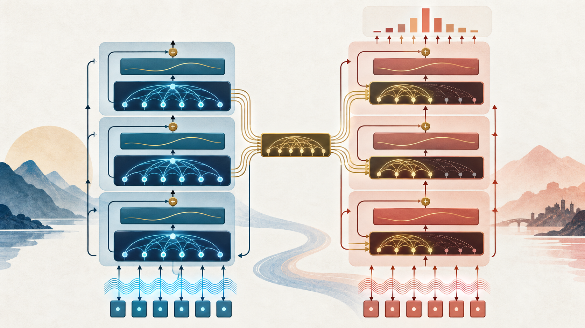

:::{.course-note-masthead .content-visible when-format="html"}


CS 351 · Introduction to Natural Language Processing<br>
Chapter 7 · The Transformer architecture
:::

Attention gives a model a powerful communication rule: each token can retrieve a weighted mixture of other representations. A complete Transformer needs more. It must encode order, transform each retrieved message nonlinearly, prevent information leakage during generation, and remain trainable when many blocks are stacked.

This chapter follows the lecture’s construction rather than presenting the final diagram all at once. Each addition repairs one concrete limitation. By the end, the encoder, decoder, and encoder–decoder Transformer will be consequences of a few explicit design choices.

{#fig-transformer-overview .chapter-overview-image width=94% fig-align="center"}

:::{.callout-note}
## Learning objectives

After this chapter, you should be able to:

1. explain why self-attention needs positional information;
2. compute sinusoidal positional encodings;
3. describe the role of the position-wise feed-forward network;
4. construct a causal attention mask;
5. explain residual connections and LayerNorm;
6. distinguish encoder, decoder, and encoder–decoder blocks;
7. identify the origins of queries, keys, and values in cross-attention;
8. select an architecture family for a task; and
9. derive the quadratic cost of full self-attention.
:::

# Position: attention needs an order {#sec-position}

## The permutation problem {#sec-permutation}

Compare “Alice thanked Bob” with “Bob thanked Alice.” The token identities are the same, but their roles are reversed. Without a separate position signal, self-attention is **permutation equivariant**. If a permutation matrix $P$ reorders the rows of $X$, then

$$
\operatorname{Attn}(PX)=P\operatorname{Attn}(X).
$$

The outputs follow the reordered inputs, but the attention mechanism has no independent fact saying which occurrence came first. This is why the original Transformer adds position representations before the first layer [@vaswani2017attention]. See also [Stanford CS224N Lecture 5](https://web.stanford.edu/class/cs224n/slides_w26/cs224n-2026-lecture05-transformers.pdf) and [The Illustrated Transformer](https://jalammar.github.io/illustrated-transformer/).

{#fig-position-signal width=92% fig-align="center"}

## Add content and position {#sec-add-position}

For token $i$, the Transformer input is

$$
\boxed{z_i=e(\text{token}_i)+p_i}.
$$ {#eq-token-plus-position}

Both vectors have dimension $d_{\text{model}}$, so addition preserves one vector per token. The word *cats* keeps the same lexical embedding wherever it occurs, but adding $p_1$ or $p_3$ produces different Transformer inputs.

:::{.callout-important}
The positional vector does not replace the token embedding. It perturbs it with an order-dependent signal while preserving the interface expected by attention.
:::

## Sinusoidal positions {#sec-sinusoidal}

The classical fixed encoding uses paired sine and cosine waves:

$$
\operatorname{PE}(pos,2i)=\sin\!\left(pos/10000^{2i/d_{\text{model}}}\right),
$$

$$
\operatorname{PE}(pos,2i+1)=\cos\!\left(pos/10000^{2i/d_{\text{model}}}\right).
$$

Each feature uses a different wavelength. Nearby positions change smoothly, while the collection of frequencies gives each position a distinctive pattern. The design also makes fixed offsets expressible through linear combinations of sine and cosine terms.

{#fig-sinusoidal-position width=92% fig-align="center"}

Other approaches include [learned absolute embeddings](https://aclanthology.org/N19-1423/), [relative position representations](https://aclanthology.org/N18-2074/), [Transformer-XL relative attention](https://aclanthology.org/P19-1285/), [RoPE](https://arxiv.org/abs/2104.09864), and [ALiBi](https://arxiv.org/abs/2108.12409). We focus here on the original sinusoidal construction because it makes the architectural role of position especially clear.

# Transform features: the position-wise FFN {#sec-ffn}

Attention communicates across tokens through weighted sums. If we only stack linear weighted mixing operations, the model lacks a strong nonlinear transformation at each position. The Transformer therefore applies the same two-layer network independently to every token:

$$
\operatorname{FFN}(x)=W_2\,\sigma(W_1x+b_1)+b_2.
$$ {#eq-positionwise-ffn}

In the original architecture, $sigma$ is ReLU, $W_1$ expands from $d_{\text{model}}$ to $d_{ff}$, and $W_2$ projects back. Modern variants often use [GELU](https://arxiv.org/abs/1606.08415), [SwiGLU](https://arxiv.org/abs/2002.05202), or gated variants.

| Sublayer | Operates across | Main role |
|---|---|---|
| Self-attention | token positions | communicate and retrieve |
| Position-wise FFN | feature dimensions | nonlinear transformation |

The same FFN parameters are reused at every position **within a layer**. Different Transformer layers have different learned parameters.

{#fig-ffn-network width=90% fig-align="center"}

# Decode without looking ahead {#sec-causal-mask}

During autoregressive generation, predicting token $y_t$ may depend on $y_{<t}$ but not on future answers $y_{>t}$. The decoder implements this rule before softmax:

$$
M_{ij}=\begin{cases}
0,&j\le i,\\
-\infty,&j>i,
\end{cases}
\qquad
A=\operatorname{softmax}\!\left(\frac{QK^\top}{\sqrt{d_k}}+M\right).
$$ {#eq-causal-attention}

Because $e^{-\infty}=0$, forbidden positions receive zero probability. Applying the mask **after** softmax is incorrect: the remaining weights would no longer be normalized.

```python
scores = q @ k.transpose(-2, -1) / math.sqrt(d_k)
mask = torch.triu(torch.ones(T, T, dtype=torch.bool), diagonal=1)
scores = scores.masked_fill(mask, float("-inf"))
weights = torch.softmax(scores, dim=-1)
output = weights @ v
```

Compare this explicit calculation with [`torch.nn.functional.scaled_dot_product_attention`](https://pytorch.org/docs/stable/generated/torch.nn.functional.scaled_dot_product_attention.html), which supports causal attention directly.

# Build depth safely {#sec-depth}

## Multi-head attention revisited {#sec-multihead-recall}

One head produces one attention distribution per query. Different heads have separate projection matrices and may learn different relations—for example, a subject–verb relation in one head and an entity-reference relation in another:

$$
\operatorname{MHA}(X)=\operatorname{Concat}(head_1,\ldots,head_h)W_O.
$$

This is a capacity argument, not a guarantee that every head receives a clean linguistic interpretation. [Clark et al.](https://aclanthology.org/W19-4828/) analyze BERT attention patterns; [BertViz](https://github.com/jessevig/bertviz) provides an interactive inspection tool.

## Residual connections {#sec-residual}

A residual sublayer learns a correction to its input:

$$
y=x+F(x).
$$

The identity path carries representations and gradients through depth even when the learned branch is initially unhelpful. The loss-landscape visual used in the lecture comes from [Li et al., *Visualizing the Loss Landscape of Neural Nets*](https://papers.nips.cc/paper/7875-visualizing-the-loss-landscape-of-neural-nets).

## Layer normalization {#sec-layernorm}

For one token vector $x\in\mathbb R^d$, LayerNorm computes statistics across its **feature dimension**:

$$
\mu=\frac1d\sum_{j=1}^d x_j,
\qquad
\sigma^2=\frac1d\sum_{j=1}^d(x_j-\mu)^2,
$$

$$
\operatorname{LN}(x)_j=\gamma_j\frac{x_j-\mu}{\sqrt{\sigma^2+\epsilon}}+\beta_j.
$$ {#eq-layernorm}

$\gamma$ and $\beta$ are learned feature-wise parameters. Statistics are computed independently for each token and example—not across tokens in the batch. Consult the [original Layer Normalization paper](https://arxiv.org/abs/1607.06450) and the [`torch.nn.LayerNorm` documentation](https://pytorch.org/docs/stable/generated/torch.nn.LayerNorm.html).

{#fig-layernorm-features width=92% fig-align="center"}

```python
class ExplicitLayerNorm(nn.Module):
    def __init__(self, d_model, eps=1e-5):
        super().__init__()
        self.gamma = nn.Parameter(torch.ones(d_model))
        self.beta = nn.Parameter(torch.zeros(d_model))
        self.eps = eps

    def forward(self, x):
        mean = x.mean(dim=-1, keepdim=True)
        var = x.var(dim=-1, keepdim=True, unbiased=False)
        return self.gamma * (x - mean) / torch.sqrt(var + self.eps) + self.beta

layer_norm = nn.LayerNorm(d_model)
```

The original Transformer uses post-norm sublayers:

$$
\operatorname{LayerNorm}(x+\operatorname{Sublayer}(x)).
$$

{#fig-add-and-norm width=88% fig-align="center"}

Many later large models use pre-norm. The distinction matters for optimization, but it does not change the conceptual roles of attention, FFN, residual routing, and normalization.

# Encoder and decoder stacks {#sec-stacks}

## The decoder {#sec-decoder}

A decoder block contains masked multi-head self-attention, Add & Norm, a position-wise FFN, and another Add & Norm. Repeating the block $L$ times gives

$$
Z^{(\ell)}=\operatorname{DecoderBlock}_{\ell}(Z^{(\ell-1)}).
$$

The final states pass through a vocabulary projection and softmax to produce next-token probabilities. Inputs are shifted target tokens plus position representations.

{#fig-decoder-stack width=92% fig-align="center"}

## Why the encoder has no causal mask {#sec-encoder-no-mask}

In translation, the complete source sentence is available before generation begins. The decoder must not inspect future French target words, because those are answers it must predict. The encoder, however, should use the complete English sentence: its job is to construct informed source representations.

For “She visited the bank to deposit cash,” the representation of *bank* benefits from both *visited* on its left and *deposit cash* on its right. Thus encoder self-attention uses the full $T\times T$ score matrix without a triangular causal mask.

An encoder block contains unmasked multi-head self-attention, Add & Norm, a position-wise FFN, and Add & Norm. Repeating it gives

$$
X^{(\ell)}=\operatorname{EncoderBlock}_{\ell}(X^{(\ell-1)}).
$$

{#fig-encoder-stack width=92% fig-align="center"}

# Cross-attention connects both towers {#sec-cross-attention}

Let $H_{enc}$ be the complete encoder memory and $Z_{dec}$ the current decoder representation. Cross-attention uses

$$
Q=Z_{dec}W_Q,
\qquad K=H_{enc}W_K,
\qquad V=H_{enc}W_V,
$$

$$
\operatorname{CrossAttn}(Z,H)=
\operatorname{softmax}\!\left(\frac{QK^\top}{\sqrt{d_k}}\right)V.
$$ {#eq-cross-attention}

| Mechanism | Query source | Key/value source |
|---|---|---|
| Encoder self-attention | encoder | encoder |
| Decoder masked self-attention | decoder prefix | decoder prefix |
| Cross-attention | decoder | encoder memory |

At each target position, the decoder query expresses what information is needed now. It scores every encoded source key, then retrieves a weighted mixture of source values. Each decoder block places this cross-attention sublayer between masked self-attention and the FFN.

{#fig-cross-attention width=92% fig-align="center"}

{#fig-complete-encoder-decoder width=94% fig-align="center"}

For a complementary implementation-oriented derivation, see the [Annotated Transformer](https://nlp.seas.harvard.edu/annotated-transformer/) and [PyTorch’s language translation tutorial](https://pytorch.org/tutorials/beginner/translation_transformer.html).

# Three Transformer families {#sec-families}

| Family | Visibility pattern | Typical output | Representative applications |
|---|---|---|---|
| Encoder-only | full bidirectional input | representation or label | classification, tagging, extractive QA, retrieval |
| Decoder-only | causal prefix | next-token distribution | generation, dialogue, code completion, in-context learning |
| Encoder–decoder | full source + causal target | target sequence | translation, summarization, generative QA |

[BERT](https://aclanthology.org/N19-1423/) exemplifies encoder-only pretraining, [GPT-3](https://arxiv.org/abs/2005.14165) exemplifies decoder-only autoregressive modeling, and [T5](https://www.jmlr.org/papers/v21/20-074.html) develops a unified encoder–decoder text-to-text framework. The family is determined primarily by the permitted communication pattern and the form of the desired output.

# Evidence and limitations {#sec-evidence}

## Translation results {#sec-translation-results}

The original Transformer achieved 28.4 BLEU on WMT 2014 English→German and 41.8 on English→French. The former improved over the previously reported best systems, including ensembles, by more than two BLEU points. The large model trained for 3.5 days on eight GPUs [@vaswani2017attention]. These results mattered because the architecture combined quality with a much more parallel training computation than recurrence.

## Transfer across tasks {#sec-transfer-results}

BERT-Large reported a GLUE score of 80.5, SQuAD 1.1 F1 of 93.2, and SWAG accuracy of 86.3. The important result was not only each number: one pretrained bidirectional encoder could be fine-tuned across many language-understanding tasks. T5 extended this transfer principle by representing every task as text-to-text and reported gains across GLUE, SuperGLUE, question answering, summarization, and translation.

:::{.callout-caution}
Benchmark metrics are not interchangeable. Compare systems within the same dataset, split, and metric—not a BLEU score directly with an F1 or accuracy score.
:::

## Full attention is quadratic {#sec-quadratic}

With $Q,K\in\mathbb R^{T\times d_k}$,

$$
S=QK^\top/\sqrt{d_k}\in\mathbb R^{T\times T}.
$$

There are $T^2$ query–key scores per head and example, and the classical per-layer attention time is $\mathcal O(T^2d)$ [@vaswani2017attention]. Doubling context length quadruples the number of scores:

| Context length $T$ | Scores $T^2$ |
|---:|---:|
| 128 | 16,384 |
| 256 | 65,536 |
| 512 | 262,144 |
| 1,024 | 1,048,576 |

This limitation motivates sparse attention, linear attention, recurrence or memory, and optimized exact algorithms. Useful entry points include [Sparse Transformers](https://arxiv.org/abs/1904.10509), [Longformer](https://arxiv.org/abs/2004.05150), [Transformers are RNNs](https://arxiv.org/abs/2006.16236), and [FlashAttention](https://arxiv.org/abs/2205.14135). These approaches make different trade-offs: some approximate or restrict the attention pattern; FlashAttention computes exact attention while reducing memory traffic.

# Synthesis {#sec-synthesis}

The complete architecture now follows from the limitations we repaired:

1. **Position** distinguishes order.
2. **Multi-head attention** communicates across tokens.
3. **The FFN** transforms each token nonlinearly.
4. **Causal masking** prevents target leakage.
5. **Residual connections and LayerNorm** make depth trainable.
6. **The encoder** reads a complete input.
7. **The decoder** generates from a prefix.
8. **Cross-attention** lets the decoder retrieve encoder memory.

The remaining question is not architectural but statistical: how can a large Transformer learn useful language representations from text without requiring a human label for every example? The next chapter answers this through **pretraining and BERT**.

## Further reading {#sec-further-reading}

- [Stanford CS224N · Attention and Transformers](https://web.stanford.edu/class/cs224n/slides_w26/cs224n-2026-lecture05-transformers.pdf)
- [Vaswani et al. · Attention Is All You Need](https://papers.neurips.cc/paper/7181-attention-is-all-you-need)
- [Jay Alammar · The Illustrated Transformer](https://jalammar.github.io/illustrated-transformer/)
- [Harvard NLP · The Annotated Transformer](https://nlp.seas.harvard.edu/annotated-transformer/)
- [PyTorch · Transformer building blocks](https://pytorch.org/tutorials/intermediate/transformer_building_blocks.html)
- [Dive into Deep Learning · Transformers](https://d2l.ai/chapter_attention-mechanisms-and-transformers/transformer.html)
- [BERT paper](https://aclanthology.org/N19-1423/)
- [T5 paper](https://www.jmlr.org/papers/v21/20-074.html)
- [FlashAttention paper](https://arxiv.org/abs/2205.14135)

# References {.unnumbered}

::: {#refs}
:::
