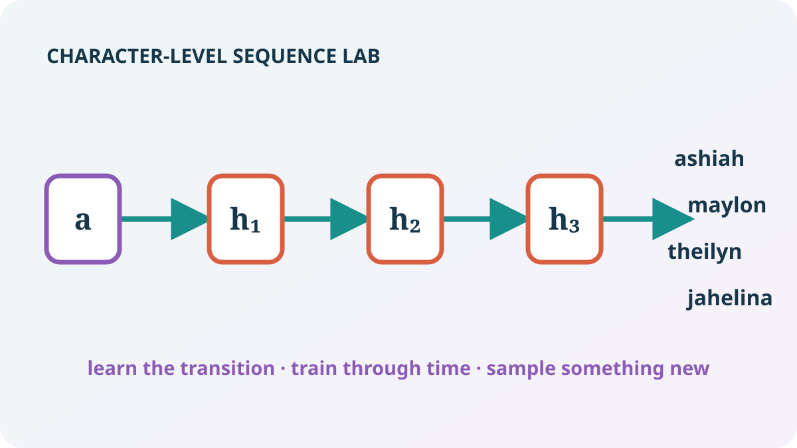

:::{.project-brief}
**Duration:** Three sessions · 1h30 each  
**Mode:** Individual or pairs  
**Format:** Three guided Jupyter notebooks  
**Deliverable:** Completed notebooks, generated samples, comparison table, and reflection
:::

{.homework-hero}

## The idea

You will compare four sequence architectures under one controlled character-level language-modeling setup:

1. begin with a transparent vanilla RNN on baby names;
2. replace its recurrent cell with LSTM and GRU cells;
3. build a small causal Transformer; and
4. transfer the strongest models from short names to longer recipe text.

Data loading, batching, optimization, evaluation, plotting, and checks are supplied. You implement only the chapter-specific operations that reveal how each architecture works.

```{mermaid}
%%| fig-cap: "The project moves from a controlled short-sequence task to richer long-form generation."
flowchart LR
    A[Baby names] --> B[Vanilla RNN]
    B --> C[LSTM + GRU]
    C --> D[Causal Transformer]
    D --> E[Recipe generation]
```

## Session 1 · A vanilla RNN invents names

The first notebook is ready. You will implement five focused pieces:

- shifted next-character inputs and targets;
- the recurrent hidden-state update;
- padded sequence cross-entropy;
- global-norm gradient clipping; and
- temperature-controlled autoregressive generation.

[Open Session 1 · Names with an RNN](starter/01_names_rnn.ipynb){.btn .btn-primary}

[Download the Session 1 starter ZIP](starter/neural-sequence-lab-session-1.zip){.btn .btn-secondary download="neural-sequence-lab-session-1.zip"}

The notebook downloads and caches the 32,033-name dataset used by Karpathy's *makemore* tutorial. A complete run ends by generating original names at three temperatures.

## Session 2 · Build the gates yourself

The second notebook keeps the data and evaluation pipeline fixed. You implement the complete forward computation of both an LSTM cell and a GRU cell: parameters, initial states, gates, memory updates, and returned states.

[Open Session 2 · Names with LSTM and GRU](starter/02_names_lstm_gru.ipynb){.btn .btn-primary}

[Download the Session 2 starter ZIP](starter/neural-sequence-lab-session-2.zip){.btn .btn-secondary download="neural-sequence-lab-session-2.zip"}

PyTorch constructs backpropagation through time from your forward operations. A supplied final-token gradient audit lets you inspect how far credit flows, without requiring a manual backward implementation.

## Session 3

| Session | Models | Final outcome |
|---|---|---|
| 3 | causal Transformer, then recipes | compare attention with recurrence and generate structured text |

:::{.callout-note}
Sessions 1 and 2 are ready. The Transformer and recipe notebook will appear here after review.
:::

## Local setup

```bash
cd projects/03-neural-sequence-lab/starter
uv sync
uv run jupyter lab
```

The notebook may also be uploaded directly to Google Colab.
